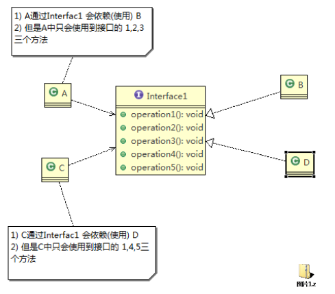
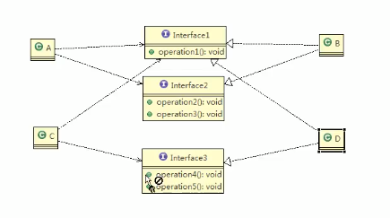
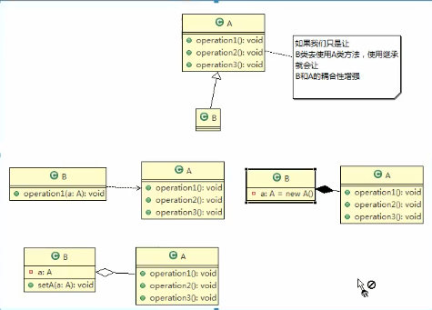
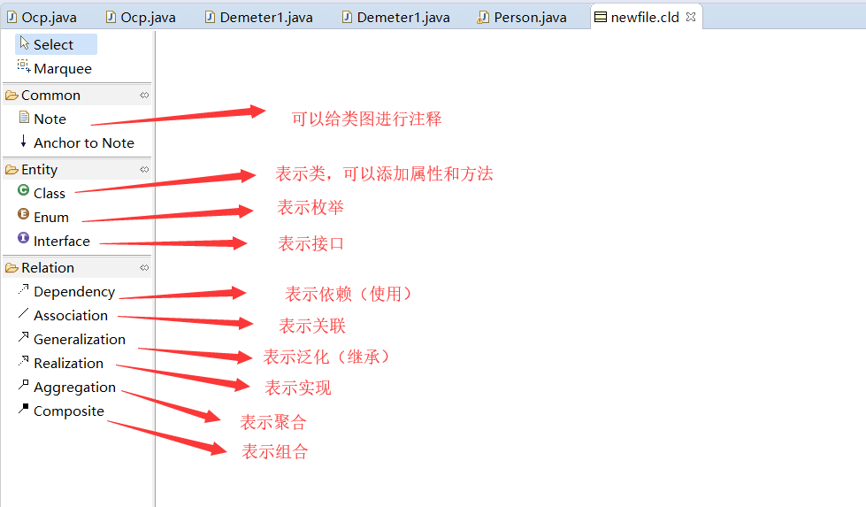
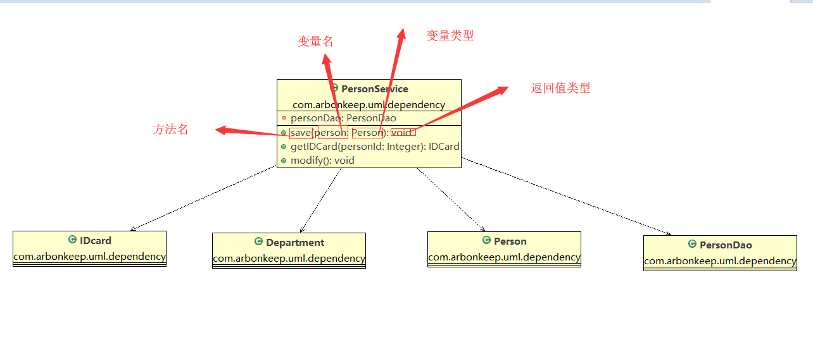
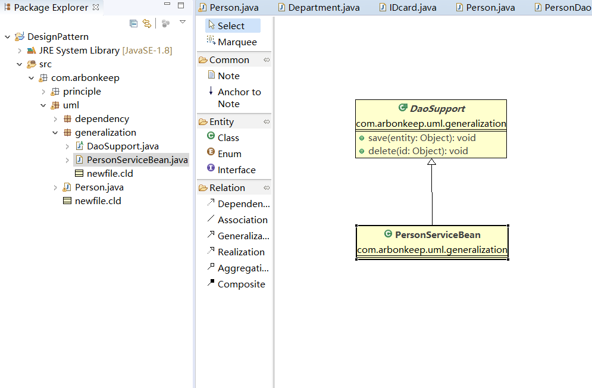
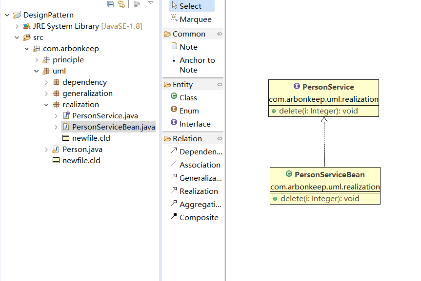
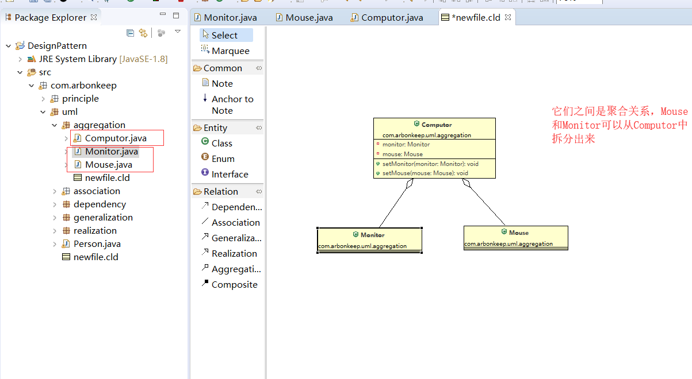
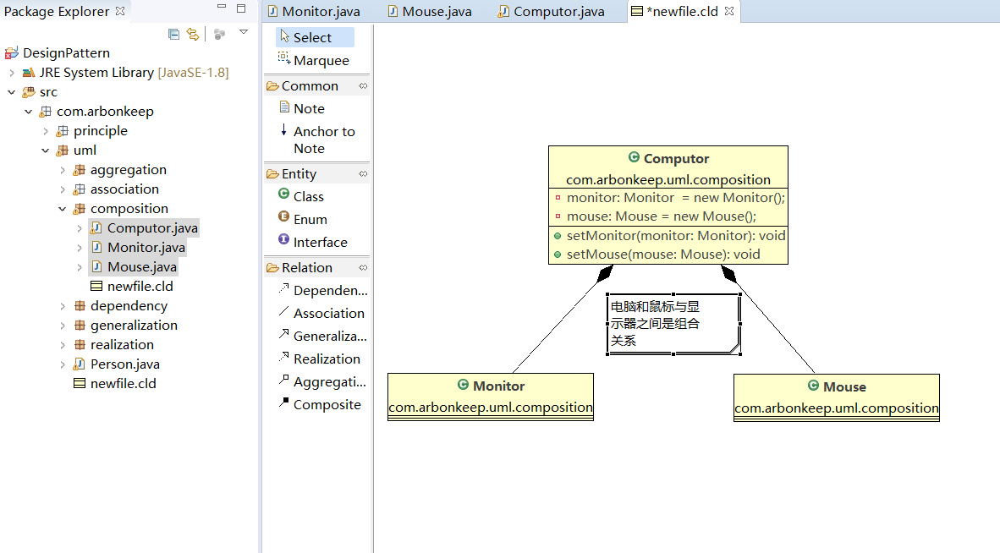
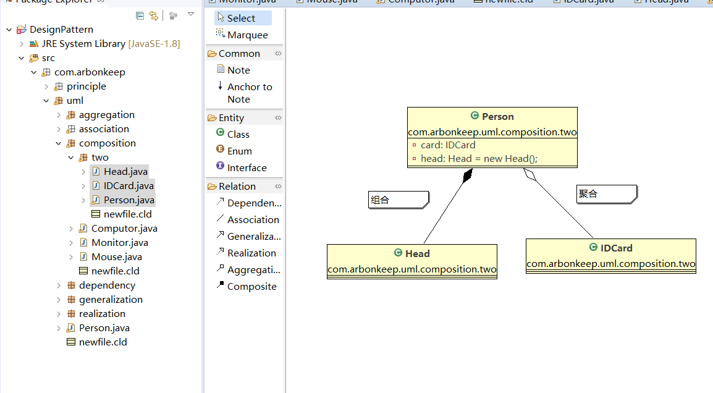

# java设计模式

## 设计模式概览
    1. 使用设计模式可以提高以下几种代码特性
        * 可重用性（相同的功能代码，不用多次编写）
        
        * 可读性（编程的规范、便于其他程序员阅读理解）
        
        * 可扩展性（需要要添加新功能时，非常方便，也就是维护性高）
        
        * 可靠性（当我们添加新功能后，对原来的功能没有影响）
        
        * 让程序达到高内聚与低耦合的特性
    
    2. 设计模式的概念
        * 在软件工程中，设计模式是对软件设计中普遍存在（反复出现）的各种问题，所提出的解决方案

    3. 设计模式在软件中哪里?
        * 面向对象（OO） ==> 功能模块（设计模式 + 算法（数据结构）） ==> 框架（使用到多种设计模式） ==> 架构（服务器集群）

    4. 设计模式可以有很好的扩展性、维护性（可读性、规范性）比较好

## 设计模式的七大原则详解
    1. 设计模式的7大原则
        <1> 单一职责原则

        <2> 接口隔离原则

        <3> 依赖倒转原则

        <4> 里氏替换原则

        <5> 开闭原则

        <6> 迪米特法则

        <7> 合成复用原则

    2. 单一职责原则
        <1> 基本介绍：对类来说，一个类应该只负责一项职责。如：类A负责两个不同的职责1,2，那么职责1需求改变类A时，可能造成职
                     责2执行错误，所以要一个类负责一个职责

        <2> 代码实现一个单一职责原则的相关类（参考代码：SingleResponsibility）

        <3> 单一职责原则的注意事项
            * 将低类的复杂度，一个类只负责一项职责

            * 提高类的可读性，可维护性

            * 降低变更引起的风险

            * 通常情况下，我们应当遵守单一职责原则，只有逻辑足够简单，才可以在代码级违反单一职责原则；只有类中的方法足够少，
              可以在方法级别保持单一原则（如代码所示）

    3. 接口隔离原则（Interface Segregation Principle）
        <1> 基本据介绍：客户端不应该依赖它所不需要的接口，即一个类对另外一个类的依赖应该建立在最小接口的基础上。如图所示,也
            就是说A会通过接口依赖B，需要使用B的方法，但是A只会使用B的1,2,3方法，4,5方法不会使用，但是这里实现了所有方法。

        <2> 代码实现一个接口隔离原则的程序（参考代码：Segregation）

        <3> 接口隔离实现方法：将接口Interface1拆分成几个独立的接口，如：在这，类A与类C分别与他们所需要的接口建立依赖关系，
                            也就是采用接口隔离原则

        <4> 接下来就通过接口隔离的方式改进一下代码，UML图如下
    

    4. 依赖倒转原则（Dependence Inversion Principle）
        <1> 基本介绍：
            * 高层模块不应该依赖低层模块，二者都应该依赖其抽象

            * 抽象不应该依赖细节，细节应该依赖抽象

            * 依赖倒转的中心思想是面向接口编程 

            * 依赖倒转的设计理念：相对于细节的多变性，抽象的东西要稳定得多。以抽象为基础搭建的构架比以细节为基础搭建的构架要
              稳定得多。在java中抽象指的是接口或抽象类，而细节指的是具体的实现类

            * 使用接口或抽象类的目的是制定好规范，而不涉及任何具体的操作，把展现细节的任务交给它们的实现类去完成

        <2> 代码实现一个依赖倒转原则的程序（参考代码：Inversion） 

        <3> 依赖关系传递的三种方式以及代码的实现
            * 三种方式
                1) 接口传递

                2) 构造方法传递

                3) setter方法传递
            
            * 代码实现参考Inversion

        <4> 依赖倒转原则的注意事项
            1) 低层模块尽量都要有抽象类或接口，或者两者都有，程序的稳定性较好

            2) 变量的声明类型尽量是抽象类或者接口，这样我们的变量引用和实际对象间就存在一个缓冲层，利于程序扩展和优化

            3) 继承是遵循里氏替换原则

    5. 里氏替换原则
        <1> 由于继承的一些弊端（如：使用继承会导致类与类之间的耦合性增强，程序的可移植性低等）那么就提出正确了使用继承的方法
            也就是里氏替换原则
 
        <2> 基本介绍
            * 如果对每个类型为T1的对象O1，都有类型为T2的对象O2，使得以T1定义的所有程序P在所有的对象O1都替换成O2时，程序P的
              行为没有发生变化，那么类型T2是类型T1的子类，也就是说，所有引用基类的地方必须能透明的使用其子类对象

            * 在使用继承时，遵循里氏替换原则在子类中尽量不要重写父类的方法

            * 继承实际上让两个类的耦合性增强了，在适当的情况下，可以通过聚合、组合、依赖来解决问题

        <3> 代码实现里氏替换原则的程序（参考代码:Liskov）

    6. 开闭原则(设计模式的核心)
        <1> 基本介绍
            * 开闭原则(Open Closed Principle)是编程中最重要、最基础的设计原则

            * 一个软件实体如类、模块和函数应该对扩展开放(对提供方)，对修改关闭(对使用方)。用抽象构建框架，用实现扩展细节

            * 当软件需要变化时，尽量通过扩展软件实体的行为来发生变化，而不是通过修改已有的代码来实现变化
            
            * 编程中遵循其它原则，以及使用设计模式的目的就是遵循开闭原则

        <2> 代码实现开闭原则（参考代码ocp）

    7. 迪米特法则
        <1> 基本介绍
            * 一个对象应该对其它对象保持最小的了解

            * 类与类之间的关系越密切，耦合度越大

            * 迪米特法则(Demeter Principle)又成最少知道原则，即一个类对自己依赖的类知道得越少越好。也就是说，对于被依赖的
              类不管多么复杂，都尽量将逻辑封装在类的内部，对外除了提供public方法，不泄露任何信息

            * 迪米特法则还有更简单的定义：只与直接朋友通信
                * 直接朋友：每个对象都会与其他对象有耦合关系，只要两个对象之间有耦合关系，我们就称这两个对象之间是朋友关系
                            耦合的方式很多，依赖，关联，聚合，组合等。其中我们称出现成员变量、方法参数，方法返回值中的类为
                            直接朋友，而出现在局部变量中的类不是直接朋友，也就是说，陌生的类最好不要以局部变量的方式出现在
                            类的内部

                * 举例：有A、B两个类，如果B的对象作为在A类成员变量、方法参数，方法返回值，那么B就是A的直接朋友

        <2> 代码实现迪米特法则相关的程序（参考代码demeter）

        <3> 迪米特法则注意事项
            * 迪米特法则的核心是降低类之间的耦合

            * 但值得注意的是：由于每个类都减少了不必要的依赖，因此迪米特法则只是要求降低类间（对象间）耦合关系，并不是要求
                             完全没有依赖关系

    8. 合成复用原则（Composite Reuse Principle）
        <1> 基本介绍
            * 原则是尽量使用合成/聚合的方式，而不是使用继承

            * 参考如下类图

    9. 设计原则的核心思想
        <1> 找出应用中可能需要变化之处，把它们独立出来，不要和那些不需要的代码混在一起

        <2> 针对接口编程，而不是针对实现编程

        <3> 为了交互对象之间的耦合设计而努力 

## UML类图

    1. UML的基本介绍
        <1> UML--Unified modeling Language(统一建模语言)，是一种用于软件系统分析和设计的语言工具，他用于帮助软件开发人
            员进行思考和记录思路的结果

        <2> UML本身是一套符号规定，就像数学符号和化学符号一样，这些符号用于描述软件模型中各个元素和它们之间的关系，比如类、
            接口、实现、泛化、依赖、组合、聚合等

        <3> 使用UML来建模，常用的工具有Rational Rose，也可以使用插件建模

        <4> 插件中UML类图的表示关系。如下

    2. UML图
        <1> 其实画UML类图就是整理思路
            * 用例图（use case）

            * 静态结构图：类图、对象图、包图、组件图、部署图

            * 动态行为图：交互图（时序图与协作图）、状态图、活动图

            * 类图是描述类与类之间的关系的，是UML图中最核心的

    3. UML类图
        <1> UML类图介绍
            * 用于描述系统中类（对象）本身的组成和了类（对象）之间的各种静态关系

            * 类之间的关系：依赖、泛化（继承）、实现、关联、聚合与组合。

            * 参考代码UML包下的person类

        <2> 类图--依赖关系
            * 只要是在类中用到了对方，那么它们之间就存在依赖关系。如果没有对方，连编译都不能够通过。

            * 怎样才会构成依赖关系：
                1) 类中用到了对方

                2) 是类的成员属性

                3) 是方法的返回类型

                4) 是方法接收的参数类型

                5) 方法中使用到的

            * 参考代码dependency包，参考如下图的UML类图分析

        <3> 类图--泛化关系
            * 泛化关系实际上就是继承关系，它是依赖关系的特例

            * 怎样才会构成关系：
                1) 如果A类继承了B类，那么就说A和B存在泛化关系

            * 参考代码dependency包

        <4> 类图--实现关系
            * 实现关系实际上就是A类实现了B类，是依赖关系的特例

            * 参考代码dependency包

        
        <5> 类图--关联关系
            * 实际上就是类与类之间的关联关系，它是依赖关系的特例

            * 关联具有导航性：即双向关系或单向关系

            * 关系具有多重性：如：“1”表示有且仅有1个，“0...”表示0个或者多个，“0,1”表示0个或者1个

            * 参考代码（association）

        <6> 类图--聚合关系
            * 聚合关系表示的是整体与部分之间的关系，整体与部分可以分开就是聚合关系。聚合关系是关联关系的特例，所以它具有关联
              的导航性和多重性

            * 参考代码(aggregation)。举例：一台电脑由鼠标(mouse)与显示器(monitor)键盘(keyboard)等组成，组成的配件都是可以
                                          分离出来的
        

        <7> 类图--组合关系
            * 组合关系：也是整体与部分之间的关系，但是整体与部分不能分开

            * 在上述例子中，如果鼠标与键盘和电脑是不可分离的，那么就是组合关系

            * 参考代码（composition），举例：Person与IDCar、Head之间，那么Person与Head之间是组合关系（不可分割），IDCard
                                           与Person之间是聚合关系（可分割）

            * 值得注意的是：如果在程序Person实体中定义了对IDCard级联删除，即单词句Person时连同IDCard一起删除，那么IDcard与
                           Person就是组合关系

            

