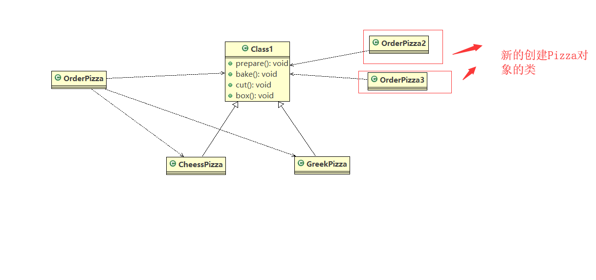
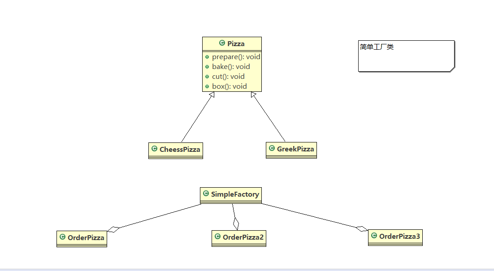
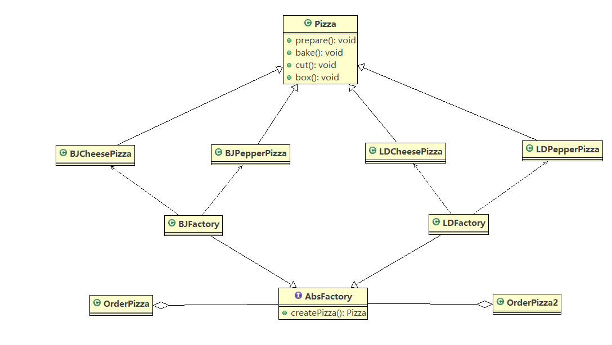

# java设计模式

## 设计模式概述
    1. 掌握设计模式的层次

    2. 设计模式介绍
        <1> 设计模式是程序员在面对同类软件工程设计问题总结出来的经验，模式不是代码，而是某类问题的通用解决方案，
            设计模式(Design Pattern)代表了最佳实践。

        <2> 设计模式本质上提高软件的维护性，通用性和扩展性，并降低软件的复杂度

        <3> 设计模式不局限于某种编程语言

    3. 设计模式的类型
        <1> 创建型模式：单例模式、抽象工厂模式、原型模式、建造者模式、工厂模式

        <2> 构建型模式：适配器模式、桥接模式、装饰模式、组合模式、外观模式、享元模式、代理模式

        <3> 行为型模式：模板方法模式、命令模式、访问者模式、迭代器模式、观察者模式、中介者模式、备忘录模式、解释器
                       模式（Interpreter模式）、状态模式、策略模式、职责链模式（责任链模式）

## 创建型模式

### 单例设计模式
    1. 介绍
        * 所谓单例设计模式，就是采取一定的方法保证整个软件系统中，对某个类只能存在一个对象实例，并且该类只提供
            一个取得其对象实例的方法（静态方法）

        * 八种实现方式：
            1) 饿汉式(静态常量)

            2) 饿汉式(静态代码块)

            3) 懒汉式(线程不安全)

            4) 懒汉式(线程安全，同步方法)

            5) 懒汉式（线程安全，同步代码块）

            6) 双重检查

            7) 静态内部类

            8) 枚举
        
    2. 饿汉式(静态常量)
        * 实现步骤:
            1) 构造器私有化

            2) 类的内部创建对象

            3) 向外部暴露一个静态的公共方法 getInstance

        * 实现参考代码singleton.type1

        * 优缺点说明
            1) 优点：写法简单，就是在类装载的时候就完成了实例化，避免了线程同步问题

            2) 缺点：在类装载的时候就完成了实例化，没有达到Lazy Loading的效果，如果从始至终没有使用过这个实例，
                        则会造成内存浪费

            3) 这种方式基于classloader机制避免了多线程同步问题，不过instance在类装载时就实例化，在单例模式中大
                多数都是调用getInstance方法，但是导致类装载的原因有很多种，因此不能确定有其他方式(或者其他静态方
                法)导致类装载，这时初始化instance就没有达到Lazy Loading的效果

            4) 结论:这种方式可用，但是可能导致内存的浪费

    3. 饿汉式(静态代码块)
        * 这种方式与静态变量的优缺点一样，同样也可能会造成内存的浪费

        * 实现参考代码singleton.type2

    4. 懒汉式(线程不安全)
        * 实现参考代码singleton.type3

        * 优缺点说明：
            1) 起到了lazy loading的效果，但是只能在单线程的情况下使用

            2) 如果在多线程的情况下，一个线程进入了if(singleton == null)判断语句块，还未来得及向下执行，另外一个
                线程也通过了这个判断语句，这时便会产生多个实例。所以在多线程环境下不能使用

            3) 在实际开发中，不要使用这种方式

    5. 懒汉式(线程安全，同步方法)
        * 实现参考代码singleton.type4

        * 优缺点说明：
            1) 解决了线程安全问题

            2) 效率太低，每个线程在想要获取类的实例的时候，执行getInstance()方法都要进行同步。而其实这个方法只执
                行一次实例化代码就够了，后面想要获得该类的实例直接return就行，方法进行同步效率太低 

            3) 在实际开发中，不要使用这种方式

    6. 懒汉式(线程安全，同步方法)--------需要注意
        * 实现参考代码singleton.type5

        * 优缺点说明：
            1) 这种方式的本意是对上面这种方法的改进，因为前面同步效率太低，改为同步产生实例的代码块

            2) 但是这种方式不能够起到线程同步的作用。因为一个线程进入了if(singleton == null)判断语句块，还未来得
                及向下执行，另外一个线程也通过了这个判断语句，这时便会产生多个实例

            3) 在实际开发中，不要使用这种方式

    7. 双重检查实现
        * 实现参考代码singleton.type6

        * 优缺点说明：
            1) Double-check概念是多线程开发中经常使用到的，在程序中我们进行了两次if(singleton == null)的判断，
               这样就可以保证线程的安全了

            2) 这样，实例化代码只执行一次，后面再次访问时，判断if(singleton == null)，自直接return实例化对象，也
               避免方法进行反复同步

            3) 线程安全，延迟加载，效率提高，在实际开发中，推荐使用这种方式

    8. 静态内部类实现
        * 实现参考代码singleton.type7

        * 优缺点说明：
            1) 这种方式采用了类的加载机制来保证初始化实例时只有一个线程

            2) 静态内部类方式在singleton类被加载时并不会立即实例化，而是在需要实例化时，调用getInstance方法，才会
               加载SingletonInstance类，从而完成Singleton的实例化

            3) 类的静态属性只会在第一次加载类时初始化，所以在这里JVM帮助我们保证了线程的安全性，在类进行初始化的时候，
                别的线程无法进入

            4) 优点: 避免了线程不安全，利用静态内部类特点实现延迟加载，效率高，推荐使用

    9. 枚举实现
        * 实现参考代码singleton.type8

        * 优缺点说明：
            1) 借助枚举实现单例模式。不仅能够避免多线程同步问题，而且还能够防止反序列化重新创建新的对象

    10. 单例模式的注意事项
        <1> 在jdk中Runtime类就是使用饿汉式来实现的

        <2> 单例模式保证了系统内存中该类只存在一个对象，节省了系统资源，对于一些需要频繁创建销毁的对象，使用单例模式
            可以提高系统性能

        <3> 当想实例化一个单例类时，必须要使用相应的获取对象的方法，而不是使用new

        <4> 单例模式使用场景:需要频繁创建和销毁对象，创建对象时时耗过多或者耗费资源过多但又经常用到的对象，工具类对象、
            频繁访问数据库或文件的对象（如数据源、session工厂）

### 工厂设计模式
    1. 简单工厂模式的引入

        <1> 首先我们实现一个普通的订购披萨的代码(参考代码factory.simplefactory)
            * 需求:要便于披萨种类的扩展，要便于维护
                1) 披萨的种类很多(比如GreekPizza、CheesePizza)

                2) 披萨的制作有prepare，bake，cut，box

                3) 完成披萨店订购功能

            * 针对上面例子代码实现的分析：
                1) 优点是容易理解，实现操作简单
    
                2) 缺点是违反了开闭原则，即对扩张开放，对修改关闭（当我们增加新的功能时，尽量不修改或少修改代码）

                3) 比如在我们增加一个PepperPizza时，需要在OrderPizza类中修改代码，同时，可能制作披萨得工厂有很多，那么
                    每个工厂都需要修改代码，这就十分麻烦，如下所示

            * 那么就需要改进，改进思路如下：
                1) 分析:修改代码可以接受，但是如果在其他的地方也有创建Pizza的代码，就意味着也需要修改，而创建Pizza的代码
                        往往有多处
    
                2) 思路:将创建Pizza的对象的代码封装到一个类当中，这样在我们有新的Pizza种类时，只需要修改类即可，其它有创
                        建Pizza对象的地方就不需要修改了 ----> 简单工厂模式

    2. 简单工厂设计模式
        
        <1> 基本介绍
            1) 简单工厂模式属于创建型模式，是工厂模式的一种。简单工厂模式是由一个工厂对象决定创建出哪一种产品类的实例。
               简单工厂模式是工厂模式中最简单实用的模式

            2) 简单工厂模式：定义了一个创建对象的类，由这个类来封装实例化对象的行为(代码)

            3) 在软件开发中，当我们会用到大量创建某种、某类或者某批对象时，就会使用到工厂模式

        <2> 代码实现参考(actory.simplefactory)
            * 在没有建立简单工厂类之前的类图关系如下

            * 在建立简单工厂类之后的类图关系如下

        <3> 补充:简单工厂模式也就静态工厂模式（可以通过定义静态的方法来实现）

    3. 工厂方法模式
        <1> 同样的，在前面的披萨例子中，我们有了新的需求：可以点不同口味的披萨，如：北京的胡椒披萨，北京的奶酪披萨，伦
            敦的胡椒披萨，伦敦的奶酪披萨

            * 那么解决上述问题可以使用简单工厂模式：创建不同的简单工厂类即可完成

            * 还可以使用工厂方法模式

        <2> 基本介绍
            * 工厂方法模式设计方案:将披萨项目的实例化功能抽象成抽象方法，在不同口味点餐子类中具体实现

            * 工厂方法模式:定义了一个创建对象的抽象方法，由子类决定实例化的类，工厂方法模式将对象的实例化推迟到子类

        <3> 代码实现（参考factorymethod）
            * 实现的类图如下所示

    4. 抽象工厂模式
        <1> 基本介绍
            1) 抽象工厂模式：定义了一个interface用于创建相关或有依赖关系的对象簇，而无需指明具体的类

            2) 抽象工厂模式可以将简单工厂模式和工厂方法模式进行整合

            3) 从设计层面看，抽象工厂模式就是对简单工厂模式的改进(或者称为进一步的抽象)

            4) 将工厂抽象成两层，AbsFactory(抽象工厂)和具体实现的工厂子类。程序员可以根据创建对象类型使用对应的工厂
               子类。这样将单个的简单工厂类变成了工厂簇，更利于代码的维护和扩展

        <2> 利用抽象工厂模式实现披萨项目（参考代码abstractfactory）
            * 使用抽象工厂模式实现披萨项目的类图如下

    5. 工厂模式的源码分析
        <1> 工厂模式在JDK的Calendar中的应用
            1) 在jdk中Calendar中就使用了简单工厂模式

        <2> 工厂模式小结
            1) 意义：将实例化对象的代码提取出来，放到一个类中统一管理和维护，达到和主项目的依赖关系解耦，从而提高项
                    目的扩展性和维护性

            2) 三种工厂模式：简单工厂模式，工厂方法模式，抽象工厂模式

            3) 设计模式的依赖抽象原则
                * 创建对象实例时，不需要直接new类，而是把这个new类的动作放在一个工厂的方法中，并返回

                * 不要让类继承具体类，而是继承抽象类或者实现interrface接口

                * 不要覆盖基类中已经实现的方法

        