# java设计模式

## 创建型模式

### 原型模式
    1. 通过克隆羊问题引入原型模式
        * 现在有一只羊tom，姓名为tom，年龄为1，颜色为白色，请编写程序创建与tom羊属性完全相同的10只羊

    2. 最简单的方式就是使用传统方式直接创建10只属性相同的羊
        * UML类图如下

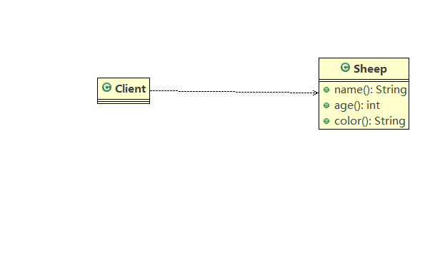

        * 传统方式的优缺点：
            1) 优点是易理解，实现简单

            2) 在创建对象时，总是需要重新获取原始对象的属性，如果创建对象比较复杂时，效率较低

            3) 总是需要重新初始化对象，而不是动态地获取对象运行时的状态，不够灵活

            4) 改进思路
                * Java中的Object类是所有类的根类，Object类提供了一个clone()方法，该方法可以将Java对象复制一份，但是需要
                  实现clone的Java类必须要实现一个接口Cloneable，该接口表示该类能够复制且具有复制能力（原型模式）

    3. 原型模式
        <1> 基本介绍
            1) 原型模式(Prototype)是指：用原型实例指定创建对象的种类，并且通过拷贝这些原型，创建新的对象

            2) 原型模式是一种创新型设计模式，允许一个对象再创建另外一个可定制的对象，无需知道如何创建的细节

            3) 工作原理:通过将一个原型对象1传给那个要发起创建的对象，这个要发起创建的对象通过请求原型对象拷贝它们自己来实
                        施创建。即对象.clone();

        <2> 原型模式的UML类图

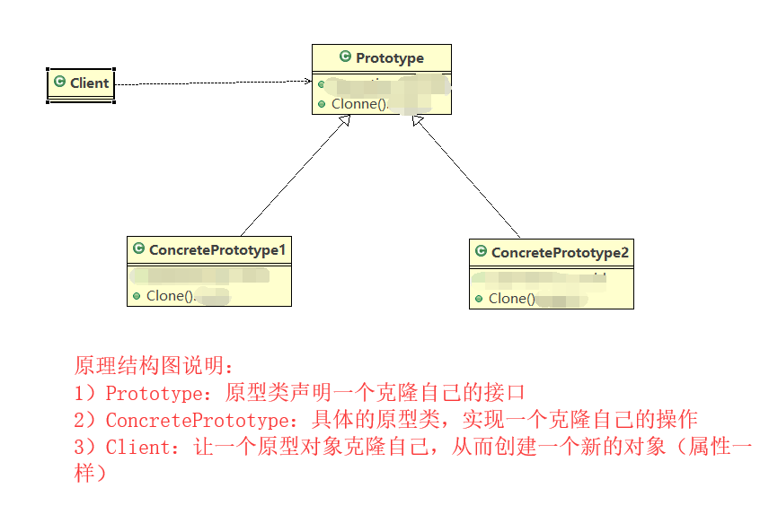

        <3> 利用原型模式代码实现克隆羊(代码参考prototype)

    4. 原型模式在Spring框架中的使用
        <1> Spring框架中bean的创建，就是原型模式的应用

        <2>代码分析与原码

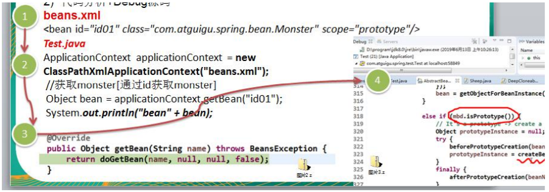

    5. 原型设计模式的浅拷贝与深拷贝
        <1> 浅拷贝介绍
            1) 对于数据类型是基本数据类型的成员变量，浅拷贝会直接进行值传递，也就是将该属性值复制一份给新的对象

            2) 对于数据类型是引用数据类型的成员变量，比如成员变量是某个数组、某个类的对象等，那么浅拷贝会进行引用传递，也就
               是将该成员变量的引用值(内存地址)复制一份给新的对象。因为实际上两个对象的该成员变量都指向同一个实例。在这种情
               况下，在一个对象中修改该成员变量会影响到另一个对象的该成员变量值

            3) 克隆羊问题就是浅拷贝的实现（如果我们在类中添加一个引用类型的成员变量，friends，然后克隆就会发现只是将地址值
               复制给克隆的对象，参考代码sheep，Client）

            4) 浅拷贝是使用默认的clone()方法来实现的    sheep = (Sheep)super.clone();

        <2> 深拷贝介绍
            1) 复制对象的所有基本数据类型的成员变量值

            2) 为所有引用数据类型的成员变量申请存储空间，并复制每一个引用数据类型成员变量所引用的对象，直到该对象可达的所有
               对象。也就是说，对象的深拷贝就是要对整个对象进行拷贝
               
            3) 深拷贝的实现方式1：重写clone方法来实现(如果有多个引用类型对象，需要进行多次操作)

            4) 深拷贝的实现方式2：通过对象序列化来实现深拷贝(推荐使用，一次性解决)

    7. 原型模式的注意事项
        <1> 创建新的对象比较复杂时，可以利用原型模式简化对象的创建过程，同时也能够提高效率

        <2> 不需要重新初始化对象，而是动态的获得对象运行时的状态

        <3> 如果原始对象发生变化（增加或者减少属性），其克隆对象也会发生变化，无需修改代码

        <4> 在实现深克隆的时候，代码可能比较复杂

        <5> 缺点：需要为每一个类都配备一个clone方法，这对全新的类来说不是很难，但是对已有的类改造时，就违背了开闭原则。

### 建造者模式
    1. 通过盖房项目引入建造者模式
        <1> 建房需求：过程为建地基，砌墙，封顶

        <2> 不同房子有不同需求：普通房、高楼

    2. 使用普通的方式来实现一个建造普通房子的功能
        <1> 普通方式的UML类图如下

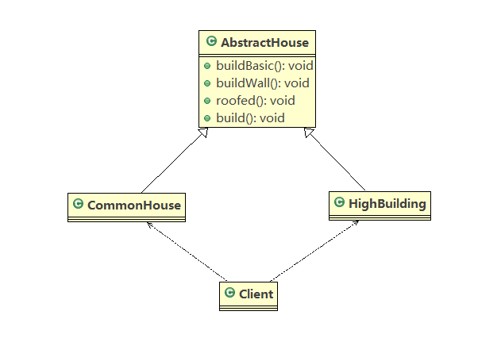
        
        <2> 参考代码builder

        <3> 分析
            1) 操作简单，易实现

            2) 设计的程序结构过于简单，没有设计缓存层对象，程序的扩展维护不好，也就是说，这种普通的设计方案把产品（房子）
               和创建产品的过程（建房子的流程）封装在一起，耦合性增强

            3) 解决思路：产品和产品的创建进行解耦--------> 建造者模式 

    3. 建造者模式 
        <1> 基本介绍
            1) 建造者模式(Duilder Pattern)又叫生成器模式，是一种对象构建模式，它可以将复杂对象的建造过程抽象出来（抽象
               类别）使这个抽象过程的不同实现方法可以构造出不同表现（属性）的对象

            2) 建造者模式是一步一步创建一个复杂对象，它允许用户只通过指定复杂对象的类型和内容就可以构建它们，用户不需要
               知道内部具体的构造细节

        <2> 建造者模式的四个角色
            1) Product(产品角色)：一个具体的产品对象

            2) Builder(抽象建造者)：创建一个product对象的各个部件指定的接口/抽象类

            3) ConcreteBuilder(具体建造者)：实现接口，构建和装配各个部件

            4) Director(指挥者)：构建一个使用Builder接口的对象，它主要用于创建一个复杂的对象。他有两个主要的作用：一是
                                隔离客户与对象的生产过程，二是负责控制产品对象的生产过程

        <3> 建造者模式的原理UML类图

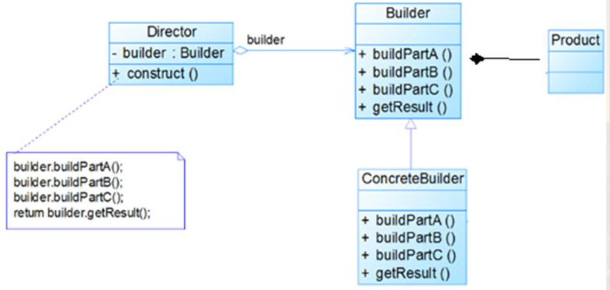

    4. 建造者模式代码实现盖房项目
        <1> UML类图如下

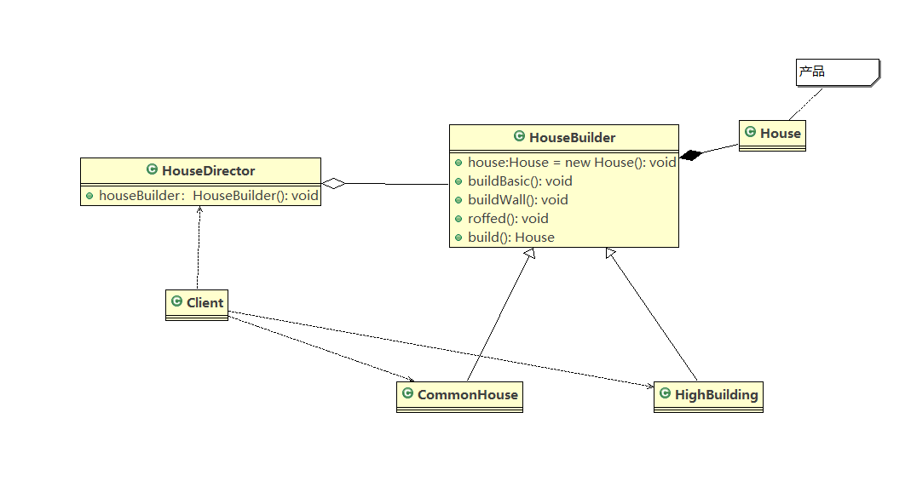

        <2> 利用建造者模式代码实现盖房子项目(参考Builder)

    5. 建造者模式在JDK源码的应用
        <1> 在jdk中StringBuilder类就使用到了建造者模式

        <2> StringBuilder中建造者角色的分析
            1) Appendable接口中定义了多个append方法（抽象方法）也就是说Appendable为抽象建造者，定义了抽象方法

            2) AbstractStringBuilder实现了Appendable接口中的方法（虽然方法依然是抽象的），这里AbstractStringBuilder
               已然是建造者，只是不能够实例化

            3) Stringbuilder既充当了指挥者的角色，有充当了具体的建造者，建造方法的实现由AbstractStringBuilder完成，而
               StringBuilder继承了AbstractStringBuilder

        <3> 代码说明与实现（参考JDKSRC下的Builder）

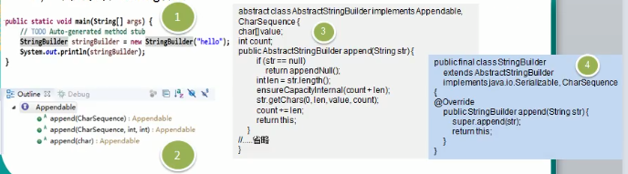

    6. 建造者模式注意事项
        <1> 客户端不必知道产品内部组成细节，将产品本身与产品的创建过程解耦，使得相同的创建过程可以创建不同的产品对象

        <2> 每一个具体建造者都相对独立，而与其他具体建造者无关，因此可以很方便的替换具体建造者或增加新的具体建造者，用户
            使用不同的具体建造者就可以得到不同的产品对象

        <3> 可以更加精细的控制产品的创建过程。将复杂产品的创建步骤分解在不同的方法中，使得创建过程更加清晰，也更方便使用
            程序来控制创建过程

        <4> 增加新的具体哦建造者无需修改原有类库代码，指挥者类针对对象建造者类编程，系统扩展方便，符合“开闭原则”

        <5> 建造者模式创建的产品一般具有较多的共同点，如果产品之间差异较大，那么就不适合使用建造者模式，因此其使用范围受
            到一定限制

        <6> 如果产品的内部变化复杂，可能会导致需要定义很多具体建造者类来实现这种变化，导致系统变得很庞大，因此在这种情况
            下，要考虑是否选择建造者模式

        <7> 抽象工厂模式VS建造者模式
            抽象工厂模式实现对产品家族的创建，一个产品家族是这样的一系列产品:具有不同分类维度的产品组合，采用抽象工厂模
            式不需要关心构建过程，只关心什么产品由什么工厂生产即可。而建造者模式则是要求按照指定的蓝图建造产品，它的主要
            目的是通过组装零配件而产生一个新产品

## 结构型模式

### 适配器模式
    1. 适配器模式的基本介绍
        <1> 适配器模式(Adapter Pattern )将某个类的接口转换成客户端期望的另一个接口表示，主要目的是兼容性。让原本因接口
            不匹配不能一起工作的两个类可以协同工作。其别名为包装器

        <2> 适配器模式属于结构性模式，主要有三类：类适配器模式，对象适配器模式，接口适配器模式 

    2. 适配器模式的工作原理
        <1> 适配器模式：将一个类的接口转换为另一个类的借口，让原本不兼容的类可以兼容

        <2> 从用户角度是看不到被适配者，是解耦的

        <3> 用户调用适配器转换出来的目标接口方法，适配器再调用被适配者的相关接口的方法

        <4> 用户收到的反馈结果，感觉只是和目标接口交互

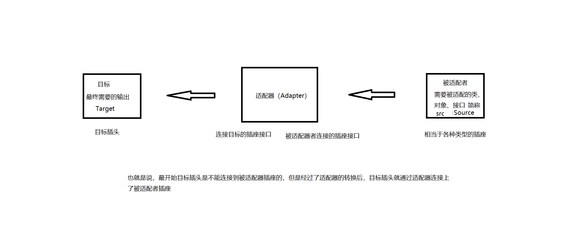

    3. 类适配器模式
        <1> 基本介绍：Adapter类，通过继承src类，实现dest接口，完成src->dest的适配

        <2> 举例：有一个5V的手机需要使用充电器（调整电压）在插座（220V）上进行充电

        <3> 类图如下：

        <4> 代码实现参考adapter.classadapter

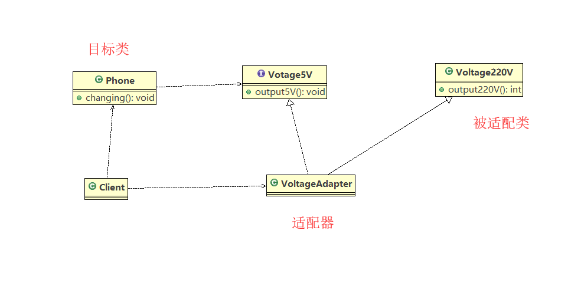

        <5> 注意事项：
            1) Java是单继承机制，所以类适配器需要继承src类这一点是一个缺点，因为这要求dest必须是接口，有一定局限性

            2) src类的方法在Adapter中都会暴露出来，也增加了使用成本

            3) 由于其集成了src类，所以它可以根据需求重写src类的方法，使得Adapter的灵活性增强了

    4. 对象适配器
        <1> 基本介绍
            1) 基本思路与类适配器相同，只是将Adapter进行修改，不在继承src类，而是持有src类的实例，已解决兼容性问题
               即：持有src类，实现dest接口，完成src-> dest的适配

            2) 根据合成复用原则，在系统中几年使用关联关系来替代继承关系

        <2> 类图如下

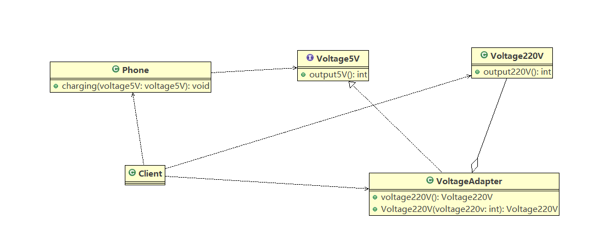

        <3> 代码实现参考adapter.objectadapter

        <4> 注意事项
            1) 对象适配器与类适配器是同一种思想，只不过实现方式不同，根据合成复用原则。使用组合替代继承，所以它解决
               了类适配器必须继承src的局限性，也不再要求dest必须是接口

            2) 使用成本低，更灵活
 
    5. 接口适配器模式
        <1> 基本介绍：
            1) 当不需要全部实现接口提供的方法时，可以先设计一个抽象类实现接口，并为该接口中的每个方法提供一个默认实
               现（空方法）那么该抽象类的子类可以有选择的覆盖父类中某些方法实现需求

            2) 实现原理:声明一个接口，接口中有若干抽象方法，然后声明一个抽象类去实现该接口并重写里面的所有方法（空
                       实现），然后再另外一个类中使用匿名内部类的方式实现具体功能

        <2> UML类图如下

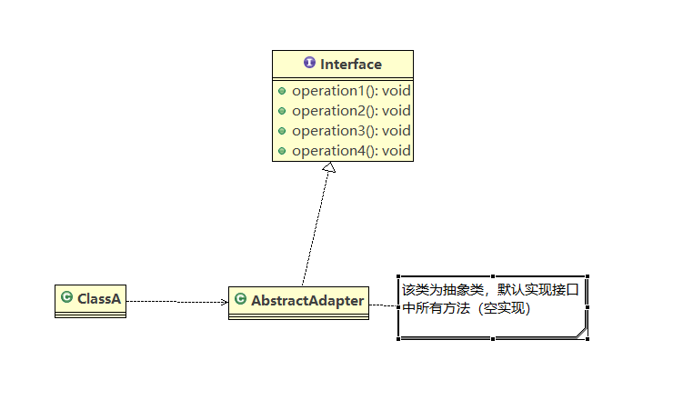

        <3> 代码实现参考InterfaceAdapter

    6. 适配器模式中的原码应用
        <1> Spring MVC中HandlerAdapter使用到了适配器设计模式（较难理解，后面总结）

        <2> 为什么要使用HandlerAdapter？
            * 我们观察可以看到处理器的类型不同，有多种实现方式，那么调用方式就不确定，如果需要直接调用Controller
              方法，需要调用的时候就得不断的使用if else来进行判断是哪一种子类然后执行。那么如果后面需要扩展Conto
              ller，就得修改源代码，违背了开闭原则

    7. 适配器模式的注意事项
        <1> 三种命名方式，是根据src是以怎样的形式给到Adapter（在Adapter里的形式）来命名的

        <2> 类适配器：以类给到，在Adapter里，就是将src当作类，继承

            对象适配器：以对象给到，在Adapter里，就是将src作为一个对象，持有

            接口适配器：以接口给到，在Adapter里，就是将src作为一个接口，实现

        <3> Adapter模式最大的作用还是将原本不兼容的接口融合在一起工作

        <4> 实际开发中，不局限与3中经典形式

    