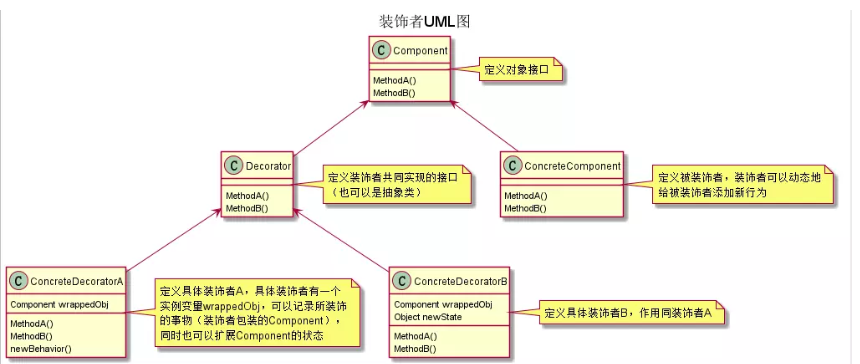

# java设计模式

## 结构型

### 桥接模式
    1. 引入手机操作问题
        * 问题描述


        * 普通实现方式UML类图如下


        * 普通解决方案的分析
            1) 扩展性问题（类爆炸），如果我们再增加手机样式（旋转式），就需要增加各个品牌手机的类，同样，如果我们增加
                一个手机品牌，也要在各个手机样式类下面增加

            2) 违反了单一职责原则，当我们增加手机样式时，要同时增加所有品牌的手机，这样增加了代码的维护成本

            3) 解决方案----> 桥接模式


    2. 桥接模式(Bridge)
        <1> 基本介绍
            1) 桥接模式：是指将实现与抽象放在两个不同的类层次中，是两个层次可以独立改变。

            2) Bridge模式是基于类的最小设计原则，通过使用封装、聚合及继承等行为让不同的类承担不同的职责。它的主要特点
               是抽象(Abstraction)与行为实现(implementation)分离开来，从而保持各部分独立性以及应对它们功能扩展

        <2> 桥接模式的原理图即分析


            * 原理图说明
                1) Client类：桥接模式的调用者

                2) 抽象类(Abstraction)：维护了Implementor/即它的实现类ConcreteImplementorA、B，二者是聚合关系，Ab
                   straction充当了桥接类

                3) RefineAbstraction：是Abstraction抽象类的子类

                4) Implementor:行为实现类的接口

                5) ConcreteImplementorA/B：行为的具体实现类

                6) 从UML类图：这里的抽象类和接口时聚合关系，是调用与被调用的关系

    3. 利用桥接模式代码实现手机操作问题
        <1> UML类图如下


        <2> 代码参考bridge

    4. 桥接模式在原码中的应用
        <1> 桥接模式在JDBC中的原码剖析
            1) JDBC的Driver接口，如果从桥接模式来看，Driver就是一个接口，下面可以有MySQL的Driver，Oracle的Driver，
               这些就可以当作实现接口类

        <2> UML类图（JDBC中应用的桥接模式）
        


    5. 桥接模式的注意事项
        1) 实现了抽象和实现部分的分离，从而极大的提供了系统的灵活性，让抽象部分和实现部分独立开来，这有助于系统进行分层
           设计，从而产生更好的结构化系统。

        2) 对于系统的高层部分，只需要知道抽象部分和实现部分的接口就可以了，其它的部分由具体业务来完成。
        
        3) 桥接模式替代多层继承方案，可以减少子类的个数，降低系统的管理和维护成本。

        4) 桥接模式的引入增加了系统的理解和设计难度，由于聚合关联关系建立在抽象层，要求开发者针对抽象进行设计和编程
        
        5) 桥接模式要求正确识别出系统中两个独立变化的维度，因此其使用范围有一定的局限性，即需要有这样的应用场景。

    6. 桥接模式的应用场景
        1) 对于那些不希望使用继承或因为多层次继承导致系统类的个数急剧增加的系统，桥接模式尤为适用.
        
        2) 常见的应用场景:
            * JDBC驱动程序
            
            * 银行转账系统
                * 转账分类:网上转账，柜台转账，AMT转账（抽象层）

                * 转账用户类型:普通用户，银卡用户，金卡用户..-消息管理（实现层）

            * 消息管理
                * 消息类型:即时消息，延时消息（抽象层）

                * 消息分类:手机短信，邮件消息，QQ消息...（实现层）

### 装饰者模式
    1. 通过星巴克咖啡订单项目引入


    2. 方式一实现咖啡项目（较差的实现方式）
        <1> UML类图如下


        <2> 分析：
            1) Drink 是一个抽象类，表示饮料

            2) description 就是描述，比如咖啡的名字等

            3) cost 就是计算费用，是一个抽象方法

            4) Decaf 等等就是具体的单品咖啡，继承 Drink,并实现 cost 方法

            5) Espresso&&Milk 等等就是单品咖啡+各种调料的组合,这个会很多种组合方式

            6) 使用这种设计方式时，会有很多的类，并且当增加一个新的单品咖啡或者调料时，类的数量就会倍增( 类爆炸)

    3. 方案二实现咖啡项目（针对方案一的改进）
        <1> 方案一中，因为咖啡单品+调料组合会造成类的倍增，因此可以做改进，将调料内置到 Drink类，这样就不会造成类数量过
            多。从而提高项目的维护性

        <2> UML类图如下


        <3> 分析：
            1) 此方案可以控制类的数量，不至于产生很多类

            2) 但是在增加或者删除调料种类时，代码维护量很大

            3) 考虑到用户可以添加多分调料，可以将hasMilk返回一个对应int

    4. 装饰者模式(Decorator)
        <1> 装饰者模式： 动态的将新功能附加到对象上。在对象功能扩展方面，它比继承更有弹性( 递归)，装饰者模式也体现了开
                       闭原则(ocp)

        <2> 原理
            1) 为了便于理解，我们举个例子来了解它：
                * 其实装饰者模式就像打包一个快递
                    * 主体：比如：陶瓷、衣服 (Component)，这就相当于被装饰者
                    * 包装：比如：报纸填充、塑料泡沫、纸板、木板(Decorator)，这些就是装饰者

                * 例如：当我们打包陶瓷时，需要考虑易碎性，所以选择的包装需要塑料泡沫等，而打包衣服只需要纸板即可

            2) 如下图：
                * 在如图的Component与ConcreteComponent之间，如果ConcreteComponent类很多,还可以设计一个缓冲层，将共
                  有的部分提取出来，抽象层一个类。



    5. 利用装饰者模式实现咖啡项目
        <1> 设计方案如下


        <2> 装饰者模式下订单
            * 关系如下


            * 说明
                1) Milk包含了LongBlack

                2) 1份Chocolate包含了(Milk + LongBlack)

                3) 1份Chocolate包含了(Chocolate + Milk + LongBlack)

                4) 这样不管什么形式的单品咖啡+调料组合，通过递归的方式都可以方便的组合和维护
    
    6. 代码实现咖啡项目
        <1> 类图如下所示


        <2> 代码实现参考decorator

    7. 装饰者模式在JDK应用的源码分析
        <1> 在Java中的IO结构中，FilterInputStream就是一个装饰者，如下图所示


        <2> 针对该结构中装饰者模式的说明(参考下面代码)
            1) InputStream是一个抽象类，类似我们之前的Drink，是一个被装饰者

            2) FileInputStream是InputStream的子类，类似于之前的LongBalck，

            3) FilterInputStream是InputStream的子类，类似之前的Decorator，是装饰者

            4) DataInpuStream是FilterInpuStream的子类，类似之前Milk，是具体的装饰者

            5) FilterInputStream类具有 protected volatile InputStream in属性，也就是包含一个被装饰者

```java
package com.arbonkeep.jdk;

import java.io.DataInputStream;
import java.io.FileInputStream;

public class Decorator {
	public static void main(String[] args) throws Exception {
		DataInputStream dis = new DataInputStream(new FileInputStream("a.txt"));
		
		System.out.println(dis.read());
		
		dis.close();
	}
}


```


    
 
