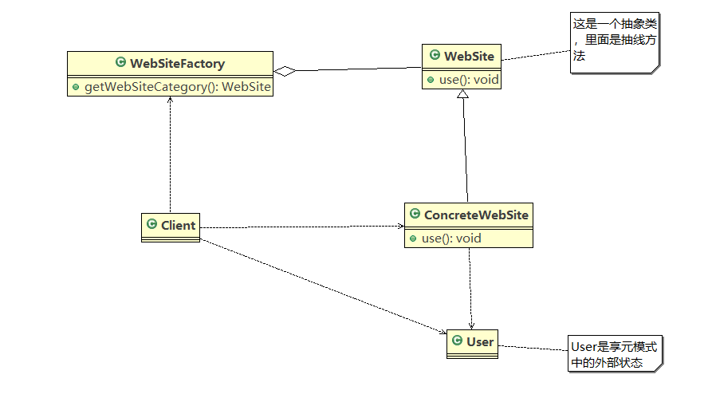

# java设计模式

## 结构型

### 组合模式
    1. 组合模式的引入
        <1> 编写一个程序展示一个学校的院系结构：要在一个页面中展示出一个学校的院系组成，一个学校有多少个学院，每个
            学院有多少个系

        <2> 传统方式是通过继承关系来解决的（实际上并不是继承，它们之间应该是包含的关系）

        <3> 针对传统方式的分析
            1) 将学院看做是学校的子类，系是学院的子类，这样实际上是站在组织大小来进行分层次的

            2) 实际上我们的要求是:在一个页面中展示出学校的院系组成，一个学校有多个学院，一个学院有多个系，因此这种
               方案，不能很好实现的管理的操作，比如对学院、系的添加，删除，遍历等

            3) 解决方案:把学校、院、系都看做是组织结构，他们之间没有继承的关系，而是一个树形结构，可以更好的实现管
                       理操作。=> 组合模式

    2. 组合模式的基本介绍
        <1> 组合模式(Composite Pattern),又叫部分整体模式，他创建了对象组的树形结构，将对象组合成树状结构以表示“整
            体部分”的层次关系

        <2> 组合模式依据树形结构来组合对象，用来表示部分以及整体的层次关系】
        
        <3> 组合模式使得用户对单个对象和组合对象的访问具有一致性，即：组合能够让客户以一致的方式处理个别对象以及整
            体对象

    3. 组合模式的原理
        <1> 原理图如下

        <2> 对原理图的描述
           * 描述参考图中定义的说明

        <3> 组合模式解决的问题
           * 当我们要处理的对象可以生成一棵树形结构，而我们要对树上的叶子和节点进行操作时，他能够提供一致的方式，而
             不用考虑它是叶子还是节点
    
    4. 组合模式解决学校院系问题
        <1> UML类图如下

        <2> 代码实现参考component 

    5. 组合模式在JDK集合中的应用
        <1> Java中的集合类HashMap就使用了组合模式

        <2> UML类图如下

        <3> 代码参考JDKSRC/Composite

    6. 组合模式的注意事项
        <1> 简化客户端操作，客户端只需要面对一致的对象而不用考虑整体部分或者叶子节点的问题

        <2> 具有较强的扩展性。当我们要更改组合对象时，我们只需要调整内部的层次关系，客户端不需要做任何改变

        <3> 方便创建出复杂的层次结构。客户端不需要理会组合里面的组成细节，容易添加节点或者叶子从而创建出复杂的树形
            结构

        <3> 需要遍历组织结构，或者处理对象具有树形结构时，适合用组合模式，如果叶子和节点有很多差异性的话，比如很多
            方法和属性都不一样，就不适合使用组合模式

## 外观模式
    1. 通过家庭影院问题引入外观模式
        <1> 影院管理项目
            * 看家庭影院，一般要经过以下几个步骤：
                直接用遥控器：统筹个设备开关
                开爆米花机
                放下屏幕
                开投影仪
                开音响
                开DVD，选DVD
                去拿爆米花
                调暗灯光
                播放
                播放结束，关闭设备

        <2> 传统方式解决思路如下

        <3> 分析：
            1) 在ClientTest 的main方法中，创建各个子系统的对象，并直接去调用子系统(对象)相关方法，会造成调用过程混乱，
               没有清晰的过程
            
            2) 不利于在ClientTest中，去维护对子系统的操作

            3) 解决思路:定义一个高层接口，给子系统中的一组接口提供-一个一 致的界面(比如在高层接口提供四个方法ready, 
                       play, pause, end ),用来访问子系统中的一群接口

            4) 也就是说就是通过定义一个一致的接口(界面类)， 用以屏蔽内部子系统的细节，使得调用端只需跟这个接口发生调用，
               而无需关心这个子系统的内部细节=> 外观模式

    2. 外观模式的基本介绍
        <1> 外观模式也叫“过程模式”，外观模式为子系统中的一组接口提供一个一致的界面，此模式定义了一个高层接口，这个接口
            使得这一子系统更加容易使用

        <2> 外观模式通过定义一个一致的接口，用以屏蔽内部子系统的细节，使得调用端只需要跟这个接口发生调用，而无需关心子
            系统的内部实现细节

    3. 原理介绍
        <1> UML类图如下

        <2> 关于外观模式的说明
            1) 外观类(Facade):为调用端提供统一调用接口，外观类知道哪些子系统负责处理请求，从而将调用端的请求代理给适当
                             的子系统对象

            2) 调用者(Client): 外观接口的调用者

            3) 子系统的集合：指模块或者子系统，处理Facade对象委派的任务，它是功能的提供者

    4. 外观模式实现影院管理项目
        <1> 外观模式下家庭影院项目的类图如下

        <2> 代码参考facade

    5. 外观模式在MyBatis中的的应用
        <1> MyBatis中的Configuration创建MetaObject就使用到了外观模式

        <2> UML类图如下

    6. 外观模式的注意事项和细节
        <1> 外观模式对外屏蔽了子系统的细节，因此外观模式降低了客户端对子系统的复杂性

        <2> 外观模式对客户端与子系统的耦合关系，让子系统内部模块更容易维护和扩展

        <3> 通过合理的使用外观模式，可以帮我们更好的划分访问层次

        <4> 当系统需要进行分层设计时，可以考虑使用Facade模式

        <5> 在维护一个遗留的大型系统时，可能这个系统已经变得非常难以维护和扩展，此时可以考虑为新系统开发一个Facade类，
            来提供遗留系统比较清晰简单的接口，让新系统与Facade类进行交互，提高复用性

        <6> 不能过多的或者不合理的使用外观模式，使用外观模式还是直接调用模块要以系统有层次，有利于维护为目的
            
## 享元模式
    1. 展示网站项目引入享元模式
        * 小型的外包项目，给客户A做一个产品显示网站，客户B也想要一个类似的网站，但是要求不同：
            <1> 有的要求以新闻形式发布

            <2> 有的要求以博客形式发布

            <3> 有的要求以公众号形式发布

    2. 传统解决方案
        <1> 直接复制粘贴一份，然后根据要求定制修改

        <2> 为每个网站租一个空间，如图所示

    3. 传统方案的解析
        <1> 需要网站的相似度很高，而且都不是高访问年网站，如果分成多个虚拟空间来处理，相当于相同网站的实例对象很多，
            造成服务器资源的浪费

        <2> 解决思路：整合到一个网站中，共享相关的代码和数据，对内存，硬盘，CPU等服务器资源都可以达到共享，减少服务
            器资源

        <3> 对于代码来说，由于是一份实例，维护和扩展都很容易--------------> 享元模式

    4. 享元模式的基本介绍
        <1> 基本介绍

            1) 享元模式(Flyweight Pattern)也叫蝇量模式，运用共享技术有效地支持大量细粒度的对象
            
            2) 常用于系统底层开发，解决系统的性能问题。像数据库连接池，里面都是创建好的连接对象，在这些连接对象中有
               我们需要的则直接拿来用，避免重新创建，如果没有我们需要的，则创建一个
            
            3) 享元模式能够解决重复对象的内存浪费的问题，当系统中有大量相似对象，需要缓冲池时。不需总是创建新对象，
               可以从缓冲池里拿。这样可以降低系统内存，同时提高效率

            4) 享元模式经典的应用场景就是池技术了，String常量池、数据库连接池、缓冲池等等都是享元模式的应用，享元模
               式是池技术的重要实现方式

        <2> 原理
            1) 原理类图如下所示

            2) 相关描述补充
                * FlyWeight是抽象的享元角色，它是产品的抽象类，同时定义出对象的外部状态和内部状态的接口或实现

                * ConcreteFlyWeight是具体的享元角色，是具体的产品类，实现抽象角色定义相关业务

                * UnSharedConcreteFlyWeight是不可共享的角色，一般不会出现在享元工厂

                * FlyWeightFactory享元工厂类用于构建一个池容器（集合）同时提供从池中获取对象的方法

            3) 举例：
                * 围棋、五子棋、跳棋，它们都有大量的棋子对象，围棋和五子棋只有黑白两色，跳棋颜色多一点，所以棋子颜色
                  就是棋子的内部状态，而各个棋子之间的差别就是位置的不同，当我们落子后，落子颜色是定的，但位置是变化
                  的，所以棋子坐标就是棋子的外部状态

                1) 享元模式提出了两个要求:细粒度和共享对象。这里就涉及到内部状态和外部状态了，即将对象的信息分为两个
                   部分:内部状态和外部状态
                
                2) 内部状态指对象共享出来的信息，存储在享元对象内部且不会随环境的改变而改变
                
                3) 外部状态指对象得以依赖的一个标记，是随环境改变而改变的、不可共享的状态。

                4) 举个例子:围棋理论上有361个空位可以放棋子，每盘棋都有可能有两三百个棋子对象产生，因为内存空间有限，
                   一台服务器很难支持更多的玩家玩围棋游戏，如果用享元模式来处理棋子，那么棋子对象就可以减少到只有两个
                   实例，这样就很好的解决了对象的开销问题

    5. 享元模式解决网站展现项目
        <1> UML类图如下

        <2> 代码实现参考flyweight

    6. 享元模式在jdk中的应用
        <1> 在java的Integer中的valueOf方法就使用到了享元模式

        <2> 详细内容请参考JDKSRC中FlyWeight

    7. 注意事项
        1) 在享元模式这样理解， “享”就表示共享，“元” 表示对象

        2) 系统中有大量对象，这些对象消耗大量内存，并且对象的状态大部分可以外部化时,我们就可以考虑选用享元模式

        3) 用唯一标识码判断，如果在内存中有，则返回这个唯一标识码所标识的对象，用HashMap/HashTable存储

        4) 享元模式大大减少了对象的创建，降低了程序内存的占用，提高效率

        5) 享元模式提高了系统的复杂度。需要分离出内部状态和外部状态，而外部状态具有固化特性，不应该随着内部状态的改变而
           改变，这是我们使用享元模式需要注意的地方

        6) 使用享元模式时，注意划分内部状态和外部状态，并且需要有一个工厂类加以控制。
        
        7) 享元模式经典的应用场景是需要缓冲池的场景，比如String常量池、数据库连接池

