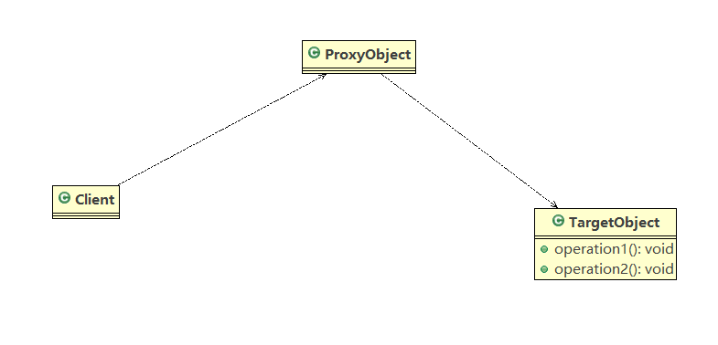
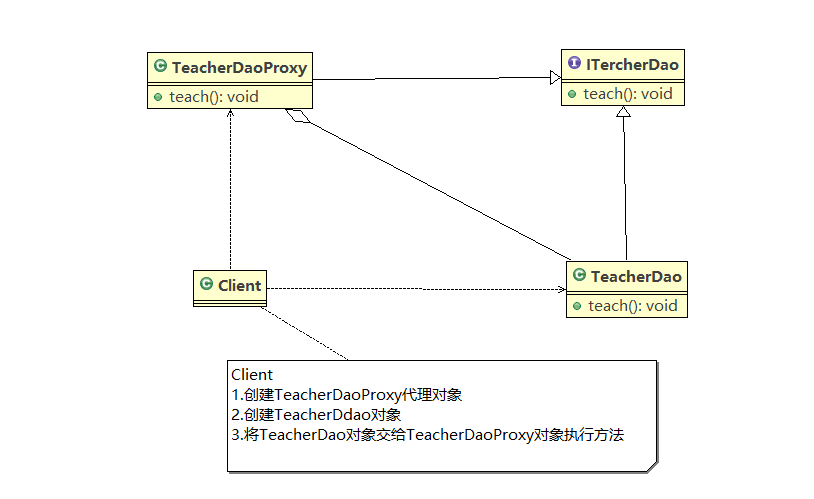
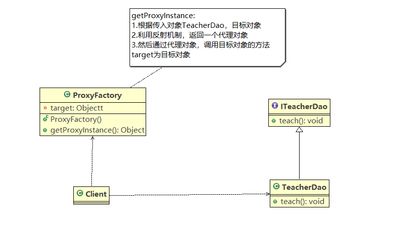
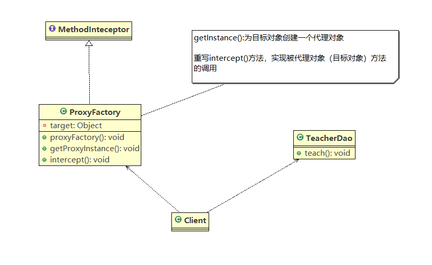
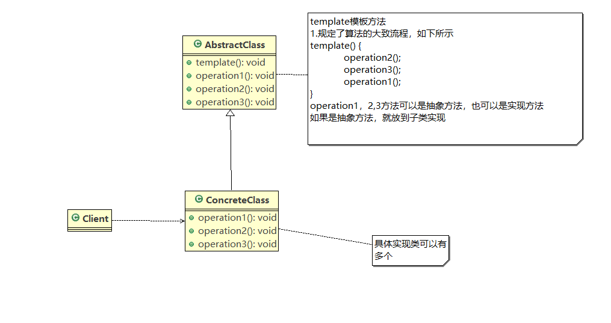
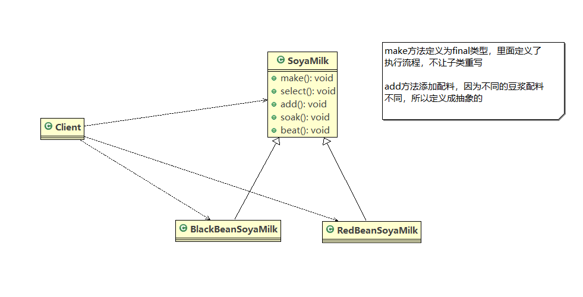
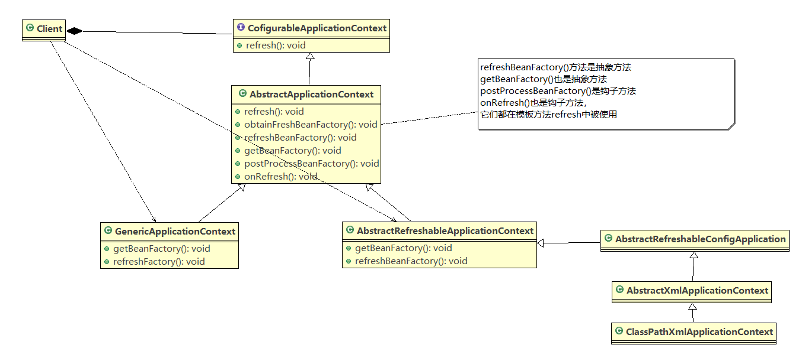
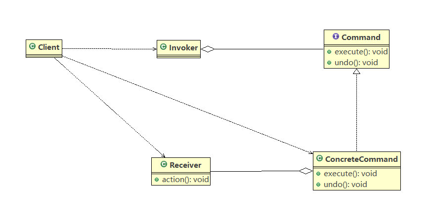
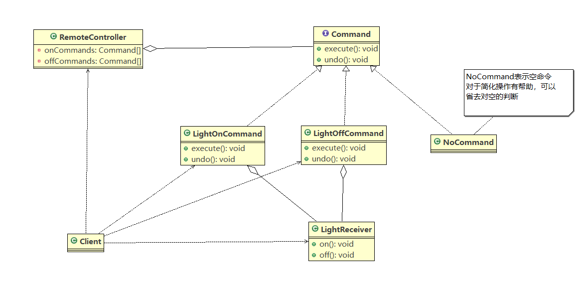

# java设计模式

## 结构型

### 代理模式(Proxy)
    1. 基本介绍
        <1> 代理模式：为对象提供一个替身，以控制这个对象的访问，即通过代理独享访问目标对象，这样做得好处是：可以
                     在目标对象实现的基础上，增强额外的功能操作，即扩展目标对象的功能

        <2> 被代理的对象可以是远程对象，创建开销大的对象或需要安全控制的对象

        <3> 代理模式有三种不同的形式：静态代理。动态代理(JDK代理，接口代理)和Cglib代理(可以在内存中动态的创建对
            象，而不需要实现接口，它是动态代理的范畴)

        <4> 代理示意图如下：

    2. 静态代理
        <1> 静态代理模式的基本介绍
            * 静态代理在使用时需要定义接口或者父类，被代理对象(即目标对象)与代理对象一起实现相同到的接口或者继承
              相同的父类

        <2> 举例：老师代课(有一个老师授课，老师(被代理对象)生病了，请了一个代课老师来代课(代理对象))

            1) UML类图如下

            2) 代码实现参考staticproxy

            3) 注意：代理对象与目标对象要实现相同接口，然后通过代理对象中调用相同方法来调用目标对象的方法

        <3> 注意事项
            1) 优点：在不修改目标对象功能的前提下，能够通过代理对象对目标功能进行扩展

            2) 缺点：因为代理对象需要与目标对象实现一样的接口，所以会有很多代理类。一旦接口增加方法，目标对象和代
                    理对象都需要维护

    3. 动态代理
        <1> 动态代理模式的基本介绍
            1) 代理对象，不需要实现接口，但是目标对象依然需要实现接口，否则不能使用动态代理

            2) 代理对象的生成是利用JDK的API，动态的在内存中构建代理对象

        <2> JDK中生成代理对象的API
            1) 代理类所在包：java.lang.reflect.Proxy

            2) JDK实现代理只需要使用newProxyInstance方法，但是该方法需要接受三个参数，完整的写法是：

                public static Object newProxyInstance(ClassLoader loader, Class<?>[] interfaces, Invocat
                ionHandler h)

        <3> 使用动态代理实现老师授课案例
            1) UML类图如下

            2) 代码参考dynamicproxy

    4. Cglib代理    
        <1> 基本介绍
            1) 静态代理和JDK代理模式都要求目标对象是实现一个接口,但是有时候目标对象只是一个单独的对象,并没有实现任何
               的接口,这个时候可使用目标对象子类来实现代理这就是Cglib代理

            2) Cglib代理也叫作子类代理,它是在内存中构建一 -个子类对象从而实现对目标对象功能扩展,有些书也将Cglib代理
               归属到动态代理。

            3) Cglib是一 一个强大的高性能的代码生成包,它可以在运行期扩展java类与实现java接口.它广泛的被许多AOP的框
               架使用,例如Spring AOP，实现方法拦截
               
            4) 在AOP编程中如何选择代理模式:
                * 目标对象需要实现接口，用JDK代理
                * 目标对象不需要实现接口，用Cglib代理

            5 Cglib包的底层是通过使用字节码处理框架ASM来转换字节码并生成新的类

        <2> 使用Cglib实现老师授课案例
            1) UML类图如下

            2) 代码参考cglib

    5. 代理模式的变体
        <1> 几种常见的代理模式介绍---几种变体
            1) 防火墙代理
                * 内网通过代理穿透防火墙，实现对公网的访问

            2) 缓存代理
                * 比如请求图片文件等资源时，先到缓存代理取，如果取到资源就返回，如果没有取到，就到公网或者数据库取，
                  然后缓存

            3) 远程代理
                * 远程对象的本地代表，通过它可以把远程对象当本地对象来调用。远程代理通过网络和真正的远程对象沟通信息

            4) 同步代理
                * 主要使用在多线程编程中，完成多线程间同步工作

## 行为型

### 模板方法模式
    1. 通过豆浆制作问题引入模板方法模式
        <1> 制作豆浆的流程选材-->添加配料-->浸泡-->放到豆浆机打碎

        <2> 通过添加不同的配料，可以制作出不同口味的豆浆

        <3> 选材、浸泡和放到豆浆机打碎这几个步骤对于制作每种口味的豆浆都是一样的,请使用模板方法模式完成

    2. 模板方法模式基本介绍
        <1> 基本介绍
            1) 模板方法模式(Template Method Pattern) ，又叫模板模式(Template Pattern)，在一个抽象类公开定义了执
               行它的方法的模板。它的子类可以按需要重写方法实现，但调用将以抽象类中定义的方式进行。是行为型模式

            2) 简单说，模板方法模式定义一个操作中的算法的骨架，而将一些步骤延迟到子类中，使得子类可以不改变一个算法
               的结构，就可以重定义该算法的某些特定步骤

        <2> 原理
            1) UML类图如下

            2) 说明
                * AbstractClass类是抽象类，在该类中有模板方法，定义了算法的骨架，子类需要具体实现抽象方法

                * ConcreteClass是具体的子类，实现抽象方法，完成算法中特定的子类实现步骤

    3. 使用模板方法模式解决豆浆问题
        <1> UML类图如下所示

        <2> 代码参考template

        <3> 模板方法模式中的钩子方法
            1) 在模板方法模式的父类中，我们可以定义一个方法，它默认不做任何事，子类可以视情况要不要实现它，该方法称
               为“钩子”

            2) 例如：针对豆浆案例，我们想制作村都建，不添加任何配料，使用钩子方法进行改造，代码参考template.improve

    4. 模板方法模式在Spring框架中的应用
        <1> Spring IOC容器初始化时运用到的模板方法模式

        <2> UML类图如下

    5. 模板方法模式的注意事项
        <1> 基本思想是:算法只存在于一个地方，也就是在父类中，容易修改。需要修改算法时，只要修改父类的模板方法或者已
                      经实现的某些步骤，子类就会继承这些修改
                      
        <2> 实现了最大化代码复用。父类的模板方法和已实现的某些步骤会被子类继承而直接使用。

        <3> 既统一了算法，也提供了很大的灵活性。父类的模板方法确保了算法的结构保持不变，同时由子类提供部分步骤的实现

        <4> 该模式的不足之处:每一个不同的实现都需要一个子类实现，导致类的个数增加，使得系统更加庞大

        <5> 一般模板方法都加上final关键字， 防止子类重写模板方法

        <6> 模板方法模式使用场景:当要完成在某个过程，该过程要执行一系列步骤，这一系列的步骤基本相同，但其个别步骤在
                               实现时可能不同，通常考虑用模板方法模式来处理

### 命令模式
    1. 通过智能生活项目引入命令模式
        <1> 我们买了一套智能家电，有照明灯、风扇、冰箱、洗衣机，我们只要在手机上安装app就可以控制对这些家电工作

        <2> 这些智能家电来自不同的厂家，我们不想针对每一 种家电都安装一个App, 分别控制，我们希望只要一个app就可以控
            制全部智能家电

        <3> 要实现一个与pp控制所有智能家电的需要，则每个智能家电厂家都要提供一个统一的接口给app调用，这时就可以考虑
            使用命令模式

        <4> 命令模式可将“动作的请求者”从“动作的执行者”对象中解耦出来

        <5> 在我们的例子中，动作的请求者是手机app, 动作的执行者是每个厂商的一个家电产品

    2. 基本介绍
        <1> 命令模式(Command Pattern):在软件设计中，我们经常需要向某些对象发送请求，但并不知道请求的接收者是谁，也
                                     不知道请求的操作时哪个，我们只需在程序运行时指定具体的接收者即可，此时可以使
                                     用命令模式来进行设计

        <2> 命令模式使得请求发送者与请求接收者消除彼此之间的耦合，让对象之间的调用关系更加灵活，实现解耦

        <3> 在命令模式中，会将一个请求封装成一个对象，以便使用不同参数来表示不同的请求（即命令）同时命令模式也支持可
            撤销操作

        <4> 举例：将军发布命令，士兵执行。其中有几个角色：将军(命令发布者)，士兵(命令的具体执行者)，命令(连接将军和
                 士兵)

    3. 原理介绍
        <1> UML类图如下

        <2> 对类图的说明
            1) Invoker是调用者

            2) Command是命令角色，需要执行的所有命令都在这里，可以是抽象类或者接口

            3) Receiver接收者角色，知道如何实施和执行一个请求的操作

            4) ConcreteCommand是具体的执行命令，将一个接受者对象和一个动作绑定，调用接收者相应的操作，实现execute

    4. 使用命令模式解决智能生活项目
        <1> UML类图如下所示

        <2> 代码实现参考command

    5. 命令模式在Spring模式中的使用
        <1> 在JDBC Template中就使用到了命令模式

        <2> 我们查看query方法，分析如下：
            1) 在这个query查询中，我们可以把 StatementCallback接口看做命令接口(command)。
            
            2) 匿名内部类 QueryStatementCallback是该命令接口的一个具体实现命令。同时也充当命令接收者

            3) 在 QueryStatementCallback中，对 doInStatement接口进行了重写，具体实现了命令的执行。（相当于执行命
               令的士兵，这里没有用具体的类去单独写）

            4) 而命令调用者(将军)，是 JDBC Template中的T execute(StatementCallback<T> action)方法。action.doI
               nStatement(stmtToUse)就是实现前面的内部类中的方法。不同实现StatementCallback接口的对象，对应不同的
               doInStatement实现逻辑

            5) 另外实现StatementCallback接口的子类还有BatchUndateStatementCallback、ExecuteStatementCallback、
               UpdateStatementCallback

    6. 命令模式的注意事项
        <1> 将发起请求的对象与执行请求的对象解耦。发起请求的对象是调用者，调用者只要调用命令对象的execute()方法就可
            以让接收者工作，而不必知道具体的接收者对象是谁、是如何实现的，命令对象会负责让接收者执行请求的动作，也就
            是说:”请求发起者”和“请求执行者”之间的解耦是通过命令对象实现的，命令对象起到了纽带桥梁的作用。

        <2> 容易设计一个命令队列。只要把命令对象放到列队，就可以多线程的执行命令 

        <3> 容易实现对请求的撤销和重做
        
        <4> 命令模式不足:可能导致某些系统有过多的具体命令类，增加了系统的复杂度，这点在在使用的时候要注意

        <5> 空命令也是一种设计模式，它为我们省去了判空的操作。在面的实例中，如果没上有用空命令，我们每按下一个按键都
            要判空，这给我们编码带来一定的麻烦。

        <6> 命令模式经典的应用场景:界面的一个按钮都是一条命令、模拟CMD (DOS命令)订单的撒销/恢复、触发-反馈机制

