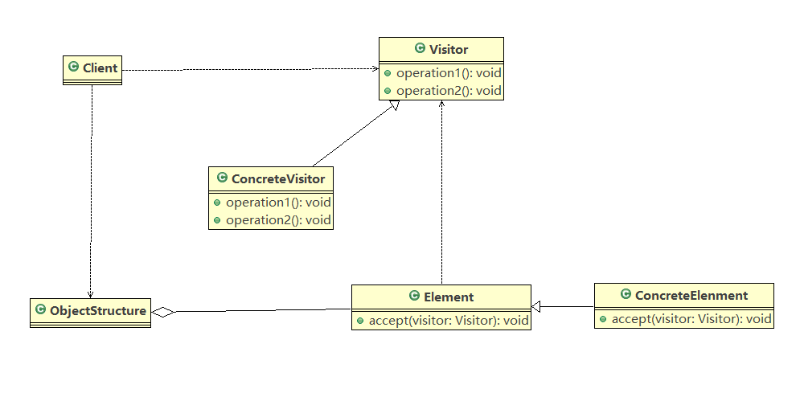
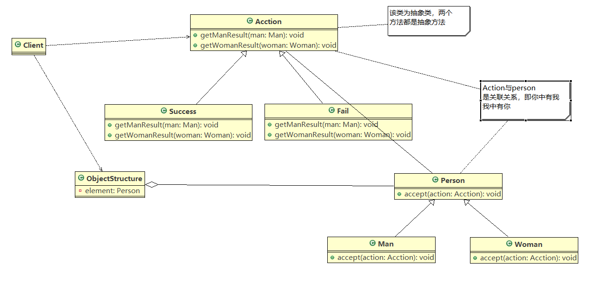
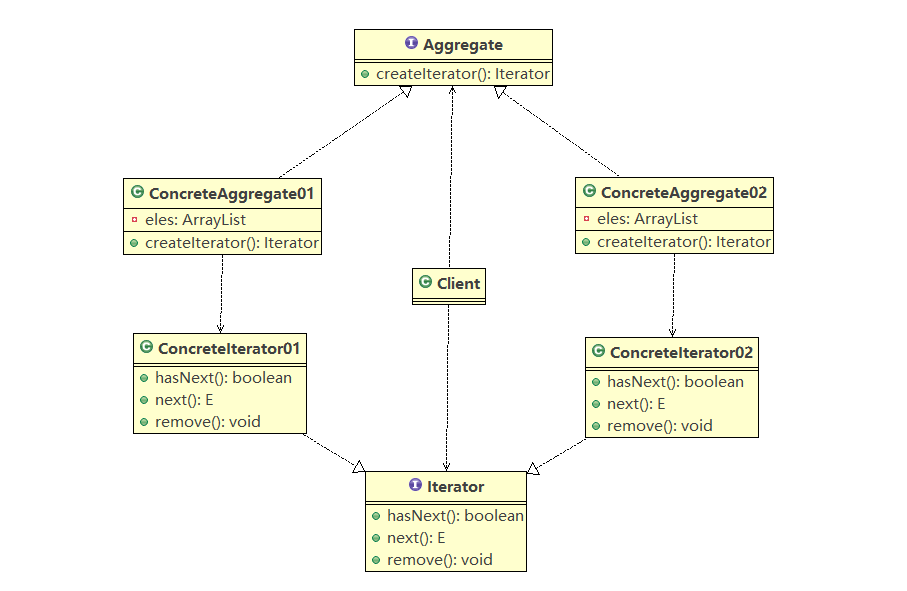
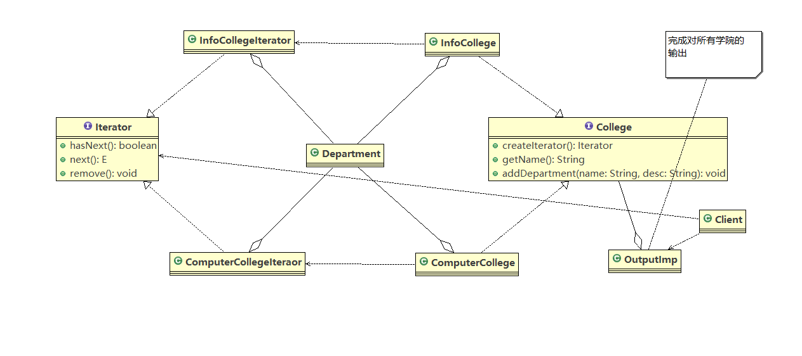
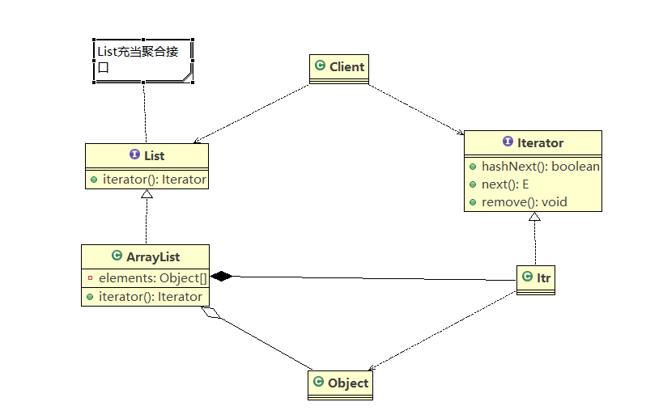
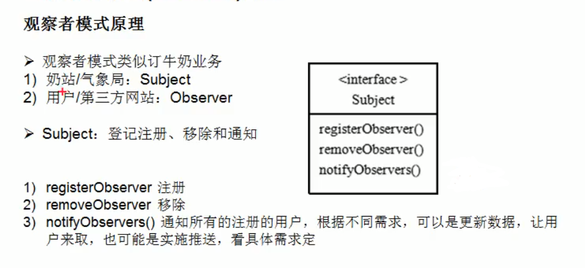
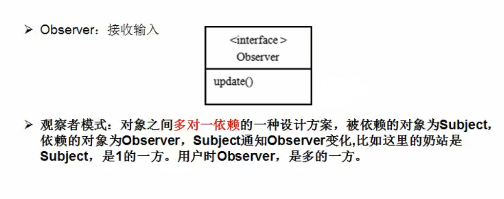
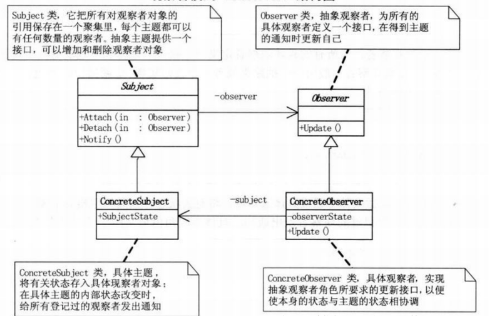
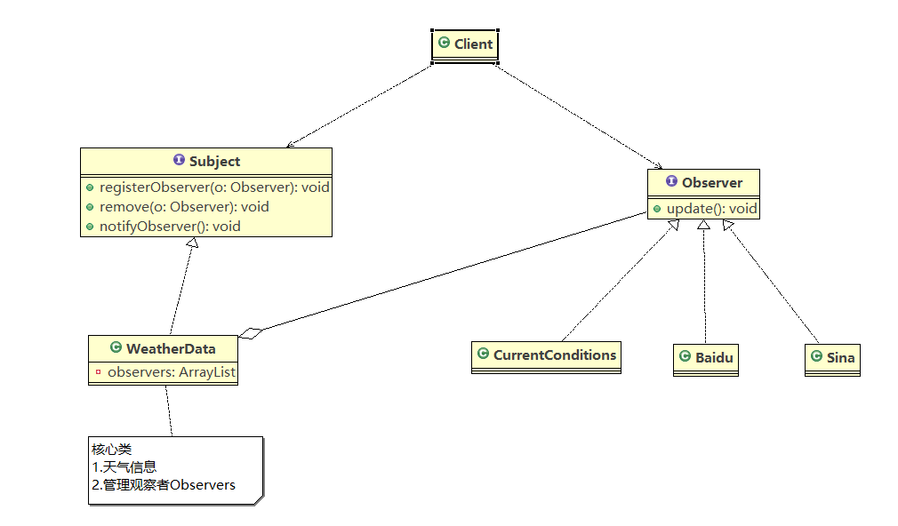

# java设计模式

## 行为型

### 访问者模式
    1. 通过测评系统案例引入
        <1> 需求：将观众分为男人和女人，对歌手进行测评，当看完某个歌手表演后，得到他们对歌手不同的评价（评价有不同的
                 种类，如：成功、失败等）

        <2> 传统解决方案：直接让Man、Woman继承Person类完成  

        <3> 传统方案的分析：
            1) 如果系统比较小，是可以的。但是考虑系统增加越来越多的功能时，对代码的改动较大，违反了开闭原则，不利于
               维护

            2) 扩展性不好，比如增加了性的人员类型，或者管理方法都不好修改

    2. 访问者模式的基本介绍
        <1> 访问者模式(Visitor Pattern)，封装一些作用于某种数据结构的各元素的操作，它可以在不改变数据结构的前提下定
            义作用于这些元素的新的操作

        <2> 主要将数据结构与数据操作分离，解决数据结构和操作耦合性问题

        <3> 访问者模式的基本原理是：在被访问的类型里面加一个对外提供接待访问者的接口

        <4> 访问者模式的主要应用场景：需要对一个对象结构中的对象进行很多不同操作(这些操作彼此之间没有关联)，同时需要
                                    避免让这些操作“污染”这些对象的类，可以选用访问者模式解决

    3. 原理
        <1> UML类图如下

        <2> 对原理类图的说明
            1) Visitor：是抽象访问者，为该对象结构中的ConcreteElement的每一个类声明一个visit操作

            2) ConcreteVisitor：是一个具体的访问者，实现每一个有Visitor声明的操作，是每个操作实现的部分

            3) Objectstructure：能枚举它的元素，可以提供一个高层的接口，用来允许访问者访问元素

            4) Element：定义一个accept方法，接收一个访问者对象

            5) ConcreteElement：为具体元素，实现了accept方法

    4. 使用访问者模式实现测评系统案例
        <1> UML类图如下

        <2> 代码参考visitor

        <3> 对案例总结
            1) 我们使用了双分派，也就是指不管类怎么变化，我们都能找到期望的方法运行。双分派意味着得到执行的操作取决于
               请求的种类和两个接收者的类型

            2) 这个模式有一个优点：也就是利于扩展，假如我们添加一个wait的判定结果，由于使用类双分派，只需要增加一个
               Action的子类即可在客户端调用即可，不需要改动其他代码

    5. 访问者模式的注意事项
        <1> 优点
            1) 访问者模式符合单一职责原则、让程序具有优秀的扩展性、灵活性非常高

            2) 访问者模式可以对功能进行统一，可以做报表、UI、拦截器与过滤器，适用于数据结构相对稳定的系统

        <2> 缺点
            1) 具体元素对访问者公布细节，也就是说访问者关注了其他类的内部细节，这是迪米特法则所不建议的，这样造成了具体
               元素变更比较困难

            2) 违背了依赖倒转原则。访问者依赖的是具体元素，而不是抽象元素

            3) 因此，如果一个系统有比较稳定的数据结构，又有经常变化的功能需求，那么访问者模式就是比较合适的

### 迭代器模式
    1. 通过院系结构的案例引入
        <1> 需求：编写程序展示一个学校的院系结构，一个学校有多少个系，每个系有多少个专业（之前组合模式的案例）

        <2> 传统方式是通过继承关系来解决的（实际上并不是继承，它们之间应该是包含的关系）

        <3> 针对传统方式的分析
            1) 将学院看做是学校的子类，系是学院的子类，这样实际上是站在组织大小来进行分层次的

            2) 实际上我们的要求是:在一个页面中展示出学校的院系组成，一个学校有多个学院，一个学院有多个系，因此这种方案，
               不能很好实现的管理的操作，比如对学院、系的添加，删除，遍历等

        <4> 如果学院都是通过数组和集合方式管理，那么需要迭代器模式解决

    2. 迭代器模式的基本介绍
        <1> 基本介绍
            1) 迭代器模式(Iterator Pattern)是常用的设计模式，属于行为型模式

            2) 如果我们的集合元素是用不同的方式实现的，有数组，还有java的集合类，或者还有其他方式，当客户端要遍历这些集
               合元素的时候就要使用多种遍历方式，而且还会暴露元素的内部结构，可以考虑使用迭代器模式解决。

            3) 迭代器模式，提供一种遍历集合元素的统-接口，用一致的方法遍历集合元素，不需要知道集合对象的底层表示，即:不
               暴露其内部的结构。

        <2> 原理
            * UML类图如下：

            * 对类图的说明
                1) Iterator:迭代器接口，是系统提供的，含有hasNext，next，remove方法

                2) ConcreteIterator：具体的迭代器类，管理迭代

                3) Aggregate：一个统一的聚合接口，将客户端与具体的聚合解耦

                4) ConcreteAggregate：具体的聚合持有对象集合，并提供一个方法，返回一个迭代器，该迭代器可以正确遍历集合

                5) Client：客户端，通过Iterator和Aggregate依赖子类

    3. 使用迭代器模式完成学院院系展示案例
        <1> UML类图如下所示

        <2> 代码参考iterator

    4. 迭代器模式在JDK中的应用
        <1> 迭代器模式在JDK中的ArrayList中被使用到了

        <2> UML类图如下

     

        <3> 对类图的说明
            1) 内部类Itr充当具体实现迭代器Iterator的类，作为ArrayList的内部类

            2) List充当了聚合接口，含有一个iterator()方法，返回一个迭代器对象

            3) ArrayList是实现聚合接口List的子类，实现了iterator()

            4) Iterator接口系统提供

            5) 迭代器模式解决了不同集合(ArrayList,LinkedList)统一遍历问题

    5. 迭代器模式的注意事项
        <1> 优点
            1) 提供一个统一的方法遍历对象，客户不用再考虑聚合的类型，使用一种方法就可以遍历对象了。

            2) 隐藏了聚合的内部结构，客户端要遍历聚合的时候只能取到迭代器，而不会知道聚合的具体组成。

            3) 提供了一种设计思想，就是一个类应该只有一个引起变化的原因(叫做单一 责任原则)。在聚合类中，我们把迭代器分开，
               就是要把管理对象集合和遍历对象集合的责任分开，这样一来集合改变的话，只影响到聚合对象。而如果遍历方式改变的
               话，只影响到了迭代器。

            4) 当要展示一组相似对象，或者遍历一组相同对象时使用，适合使用迭代器模式

        <2> 缺点
            1) 每个聚合对象都要一一个迭代器， 会生成多个迭代器不好管理类

### 观察者模式
    1. 通过天气预报项目引入观察者模式
        <1> 需求
            1) 气象站可以将每天测量到的温度，湿度，气压等等以公告的形式发布出去(比如发布到自己的网站或第三方)。

            2) 需要设计开放型API，便于其他第三方也能接入气象站获取数据。

            3) 提供温度、气压和湿度的接口

            4) 测量数据更新时，要能实时的通知给第三方

        <2> 传统方式解决
            * 方案一：设计出一个WeatherData类里面包括气温，气压，湿度属性，以及对应的get方法和一个dataChange方法(可获
                     取所有信息)

                1) 通过getXxx可以让第三方接入，并获取相关信息

                2) 当数据更新时，调用dataChange方法去更新数据，当第三方再次获取就能得到最新数据，也可以推送

            * 方案二：推送（设计出一个WeatherData类同时，定义CurrentConditions类里面包括update方法和diaplay方法）

                1) CurrentConditions(当天的天气情况)

        <3> 代码实现第二个方案（推送），参考observer

        <4> 对传统模式的分析；
            1) 其他第三方介入气象站获取数据的问题

            2) 无法在运行时动态的添加第三方

            3) 违反了开闭原则

    2. 观察者模式原理
        1) 描述如下图所示

        2) 原理类图如下所示

    3. 使用观察者模式实现天气预报项目
        <1> UML类图

        <2> 代码参考observer.improve

    4. 观察者模式在JDK中的应用
        <1> java中的Observable中使用到了观察者模式

        <2> 针对Observable类中角色的说明
            1) Observable的作用和地位等价于我们前面讲过Subject

            2) Observable是类，不是接口，类中已经实现了核心的方法,即管理Observer的方法addObserver、deleteObserveer 
               notifyObservers

            3) Observer的作用和地位等价于我们前面讲过的Observer,有update
            
            4) Observable和Observer的使用方法和前面讲过的一-样，只是Observable是类，通过继承来说实现观察者模式

            
 