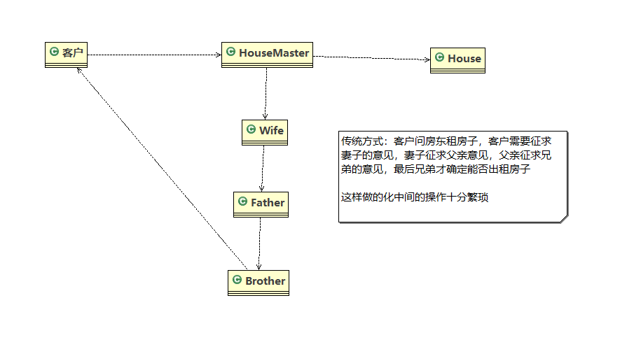
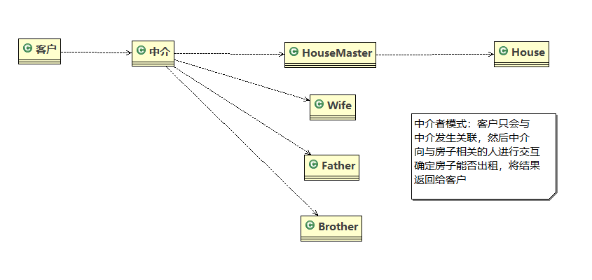
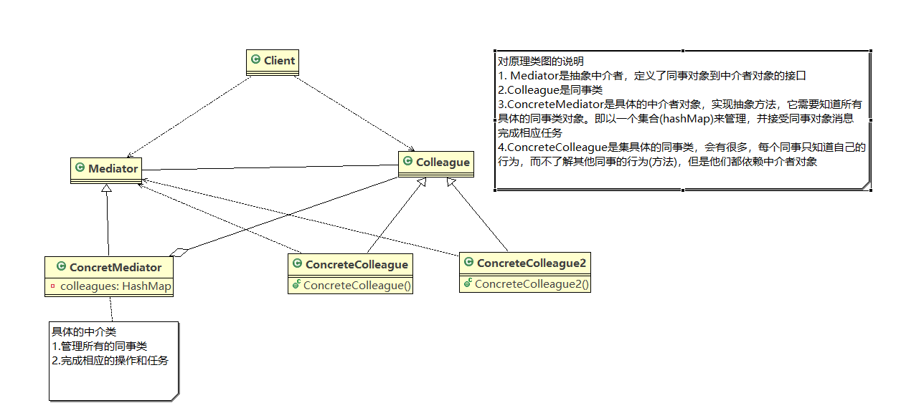
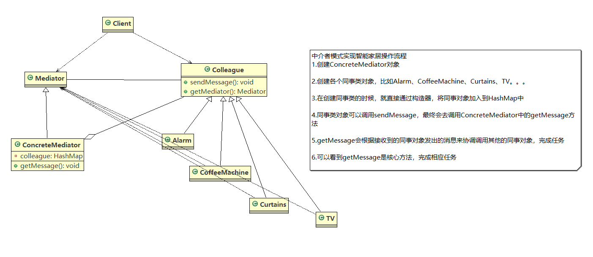
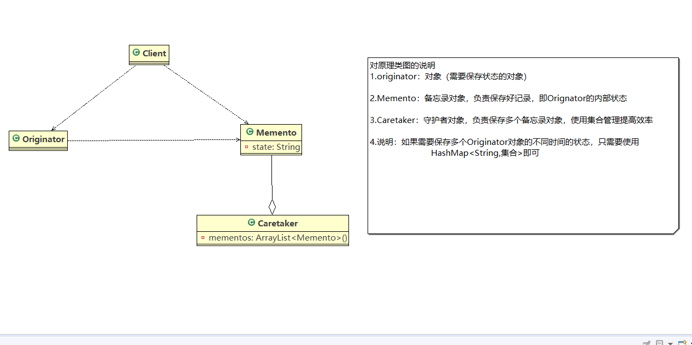
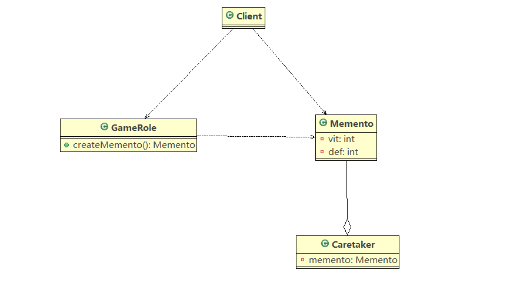
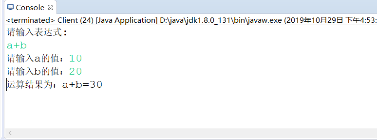
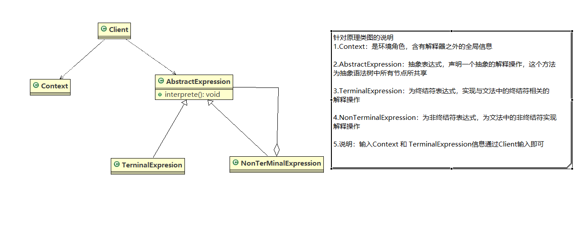
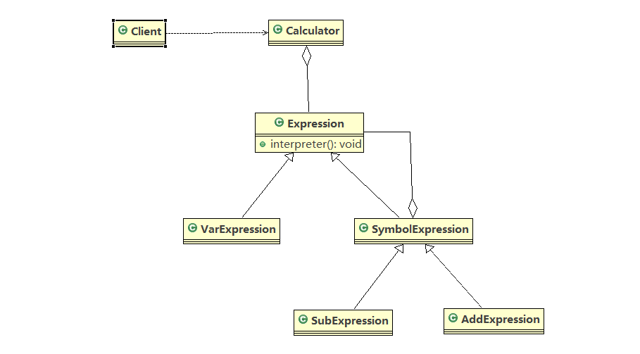

# java设计模式

## 行为型

### 中介者模式
    1. 通过智能家居项目引入中介者模式
        <1> 需求：
            1) 智能家庭包括各种设备，闹钟、咖啡机、电视机、窗帘等

            2) 在看电视时，各个设备需要协同工作，流程：闹钟响起-> 咖啡机开始做咖啡-> 窗帘自动落下-> 电视机开始播放

        <2> 举例租房项目
            1) 传统方式如下所示

            2) 使用中介者模式如下所示1

        <3> 传统方式分析
            1)当各电器对象有多种状态改变时，相互之间的调用关系会比较复杂
            
            2)各个电器对象彼此联系，你中有我，我中有你，不利于松耦合

            3)各个电器对象之间所传递的消息(参数)，容易混乱

            4)当系统增加一个新的电器对象时，或者执行流程改变时，代码的可维护性、扩展性都不理想 -->考虑中介者模式

    2. 中介者模式的基本介绍
        <1> 基本介绍
            1) 中介者模式(MediatorPattern) ，用一个中介对象来封装一系列的对 象交互。中介者使各个对象不需要显式地相
               互引用，从而使其耦合松散，而且可以独立地改变它们之间的交互

            2) 中介者模式属于行为型模式，使代码易于维护

            3) 比如MVC模式，C (Controller控制器)是M[ (Model模型)和V (View视图) 的中介者，在前后端交互时起到了中间
               人的作用

        <2> 原理类图如下所示

    3. 使用中介者模式实现智能家居项目
        <1> UML类图如下所示

        <2> 代码实现参考mediator

    4. 中介者模式的注意事项
        <1> 中介者模式的核心就是减少了具体同事类之间的关联，减少了依赖，降低了耦合，符合迪米特法则

        <2> 多个类相互耦合，会形成网状结构，使用中介者模式将网状结构分离为星型结构，进行解耦

        <3> 中介者承担了较多的责任，一旦中介者出现了问题，整个系统就会受到影响

        <4> 如果设计不当，中介者对象本身变得过于复杂，在使用该模式时需要注意

### 备忘录模式
    1. 通过游戏角色状态恢复问题引入备忘录模式
        <1> 介绍：游戏角色有攻击力和防御力，在大战boss前需要保存自身攻击力和防御力，大战boss后攻击力和防御力都会下降
                 ，那么这时我们就需要利用备忘录模式恢复状态

        <2> 传统解决方案是：定义角色类，每个角色类对应一个对应的状态属性类，这样的话，如果有很多游戏角色就会导致有很多
                           状态属性类

        <3> 分析：
            1) 使用传统方式一个对象对应一个属性类，不利于管理，开销很大

            2) 传统方式是简单的备份，new出另外一个对象来，再把需要备份的数据放到这个新对象，这样会暴露对象内部细节

    2. 备忘录模式的基本介绍
        <1> 基本介绍
            1) 备忘录模式(menmento Pattern)在不破坏封装性的前提下，捕获一个对象的内部状态，并在该对象之外保存这个状
               态。这样以后就可以将该对象恢复到原来保存的状态

            2) 理解：在现实生活中，备忘录就是用来存储记录人们容易忘记的事情，而在软件层面，也类似，备忘录对象主要用于
                    记录一个对象的某种状态，或者某些数据，当需要回退时，可以从备忘录对象中获取原来数据进行恢复

        <2> 原理类图如下

        <3> 原理代码参考memento.theory

    3. 通过备忘录模式实现游戏角色状态恢复案例
        <1> UML类图如下所示

        <2> 代码实现参考memento.game

    4. 备忘录模式的注意事项
        1) 给用户提供了-种可以恢复状态的机制，可以使用户能够比较方便地回到某个历史的状态

        2)实现了信息的封装，使得用户不需要关心状态的保存细节

        3)如果类的成员变量过多，势必会占用比较大的资源，而且每一次保存都会消耗一定的内存，这个需要注意

        4) 适用的应用场景: 1、后悔药。2、打游戏时的存档。3、Windows里的ctri +Z。4、IE中的后退。5、 数据库的事务管理

        5)为了节约内存，备忘录模式可以和原型模式配合使用

### 解释器模式
    1. 通过四则运算问题引入解释器模式
        <1> 需求：
            1) 先输出表达式的形式，比如a+b+c-d+e，要求表达式的字母不能重复

            2) 然后分别输入a、b、c、d、e的值

            3) 最后得出结果

        <2> 传统方式解决分析
            1) 传统方式：接收一个表达式的形式，然后根据用户输入的值进行解析，得到结果

            2) 问题分析：如果加入新的运算符，比如：/或*,那么就不利于扩展，另外让一个方法来解析会造成程序结构混乱，不够
                        清晰
            
            3) 解决方案：使用解释器模式。即：表达式----> 解释器(可以有多种)-----> 结果

    2. 解释器模式的基本介绍
        <1> 基本介绍
            1) 在编译原理中，一个算术表达式通过词法分析器形成词法单元，而后这些词法单元再通过语法分析器构建语法分析树，
               最终形成一棵抽象的语法分析树，这里的词法分析器和语法分析树都可以看作是解释器

            2) 解释器模式(Interpreter Pattern):是指给定一个语言表达式，定义它的文法的一种表示，并定义一个解释器，使用
               该解释器来解释语言中的句子(表达式)

            3) 应用场景
                - 应用可以将一个需要解释执行的语言的句子来表示一个抽象语法树

                - 一些重复出现的问题可以用一种简单的语言来表达

                - 一个简单的语法需要解释的场景

            4) 这样的例子还有：编译器、运算表达式计算、正则表达式、机器人等

        <2> UML类图如下

    3. 使用解释器模式实现四则运算案例
        <1> UML类图如下所示

        <2> 代码参考interpreter

    4. 解释器模式在Spring框架中的应用
        <1> 在Spring框架中的SpelExpressionParser中使用到了解释器模式

        <2> 类图如下所示

        <2> 说明
            1) Expression接口：表达式接口

            2) 接口下面有不同的实现子类，比如SpelExpression和CompositeStringExpression

            3) 使用的时候，根据创建的不同的Parser对象，返回不同的Expression对象(参考parseExpression方法的内部实现)

    5. 解释器模式的注意事项
        <1> 当有一个语言需要解释执行，可将该语言中的句子表示为一个抽象语法树，就可以考虑使用解释器模式，让程序具有良好
            的扩展性

        <2> 使用解释器可能带来的问题:解释器模式会引起类膨胀，解释器模式采用递归调用方法，将会导致调试非常复杂、效率可
            能降低

