# java设计模式

## aaaa

## 行为型

### 状态模式
    1. 通过App抽奖活动案例引入状态模式
        * 如下图所示

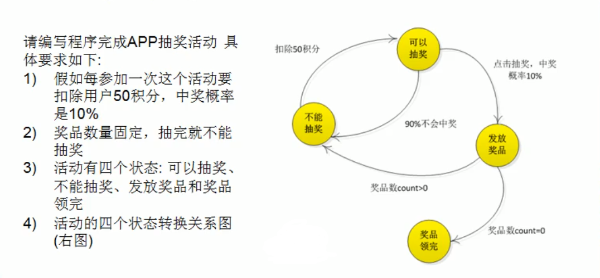

    2. 状态模式的基本介绍
        <1> 基本介绍
            1) 状态模式(State Pattern):它主要用来解决对象在多种状态转换时，需要对外输出不同的行为的问题。状态和行为是
               一一对应的，状态之间可以相互转换

            2) 当一个对象的内在状态改变时，允许改变其行为，这个对象看起来像是改变了其类

        <2> 原理类图
            
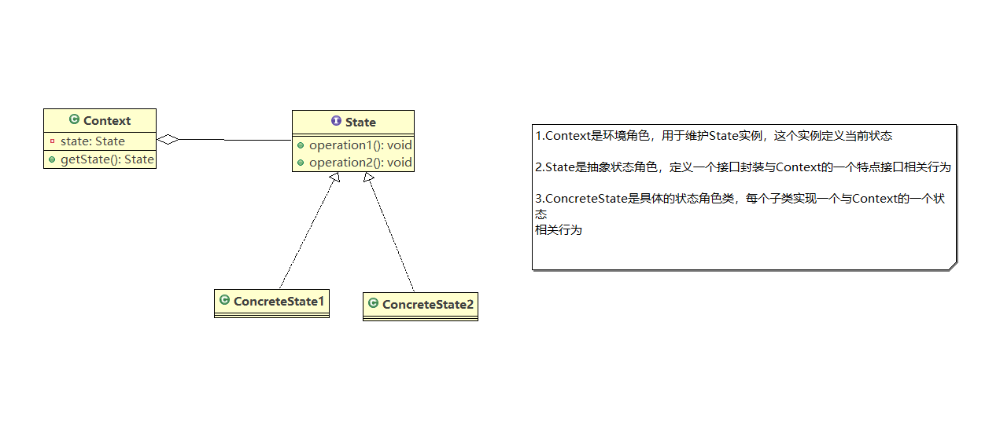

    3. 使用状态模式实现App抽奖案例
        <1> UML类图如下

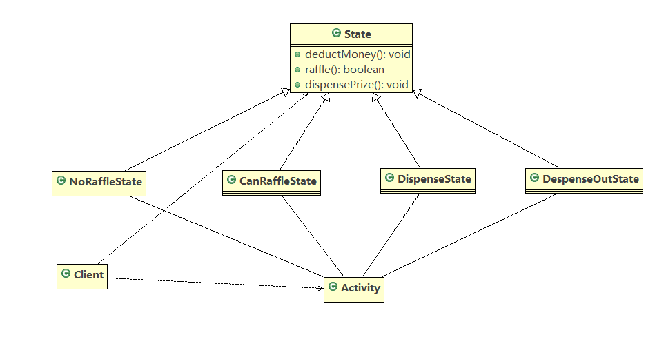

        <2> 代码参考state

    4. 源码分析
        <1> 状态模式在实际项目---借贷平台中的应用
            1) 借贷平台的订单，有审核、发布、抢单等等步骤，随着操作的不同，会改变订单的状态，项目中的这个模块实现就会使
               用到状态模式

            2) 订单状态图如下

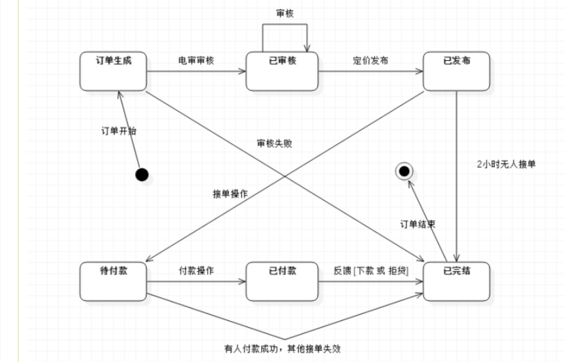

            3) 通常情况，我们会使用if else语句判断订单的状态，从而实现不同的逻辑。
                * 问题分析：通过if else实现难以应对变化，在添加一种状态时，我们需要手动添加if/else，在添加一种功能时，
                           要对所有的状态进行判断。因此代码会变得越来越臃肿，并且一旦没有处理某个状态，便会发生及其严
                           重的BUG，难以维护

            

        <2> UML类图如下

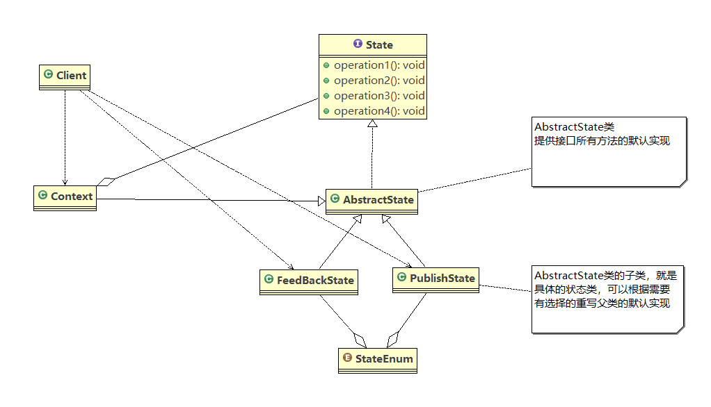

        <3> 代码请参考state.money

    5. 状态模式的注意事项
        1) 代码有很强的可读性。状态模式将每个状态的行为封装到对应的一个类中

        2) 方便维护。将容易产生问题的if-else语句删除了，如果把每个状态的行为都放到一个类中，每次调用方法时都要判断当前
           是什么状态，不但会产出很多if-else语句，而且容易出错

        3) 符合“开闭原则”。容易增删状态
        
        4) 会产生很多类。每个状态都要一个对应的类，当状态过多时会产生很多类，加大维护难度
        
        5) 应用场景:当一个事件或者对象有很多种状态，状态之间会相互转换I对不同的状态要求有不同的行为的时候，可以考虑使用
                   状态模式

### 策略模式
    1. 通过鸭子问题引入策略模式
        <1> 需求
            1) 有各种鸭子(比如：野鸭，北京鸭，水鸭等，鸭子有各种行为，如：叫，飞行等)

            2) 显示鸭子的信息

        <2> 传统方案使用继承实现
            1) UML类图如下

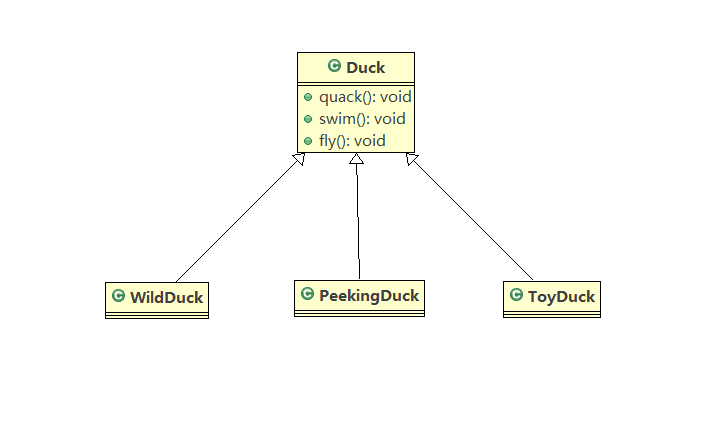

            2) 代码实现参考strategy

            3) 问题分析
                - 其它鸭子，都继承了Duck类，所以fly让所有子类都会飞了，这是不正确的

                - 上面说的问题，其实是继承带来的问题:对类的局部改动，尤其超类的局部改动，会影响其他部分。会有溢出效应

                - 为了改进1问题，我们可以通过覆盖fly方法来解决=>覆盖解决

                - 问题又来了，如果我们有一个玩具鸭子ToyDuck,这样就需要ToyDuck去覆盖Duck的所有实现的方法=>策略模式

    2. 策略模式的基本介绍
        <1> 基本介绍
            1) 策略模式(Strategy Pattern)中，定义算法簇，分别封装起来，让他们之间可以互相替换，此模式让算法的变化独
               立于使用算法的客户

            2) 这种模式体现了几个原则
                - 把变化的代码从不变化的代码中分离出来

                - 针对接口编程而不是具体的类(定义了策略接口)

                - 多用组合、聚合，少用继承(客户通过组合方式使用策略)

        <2> UML类图如下所示

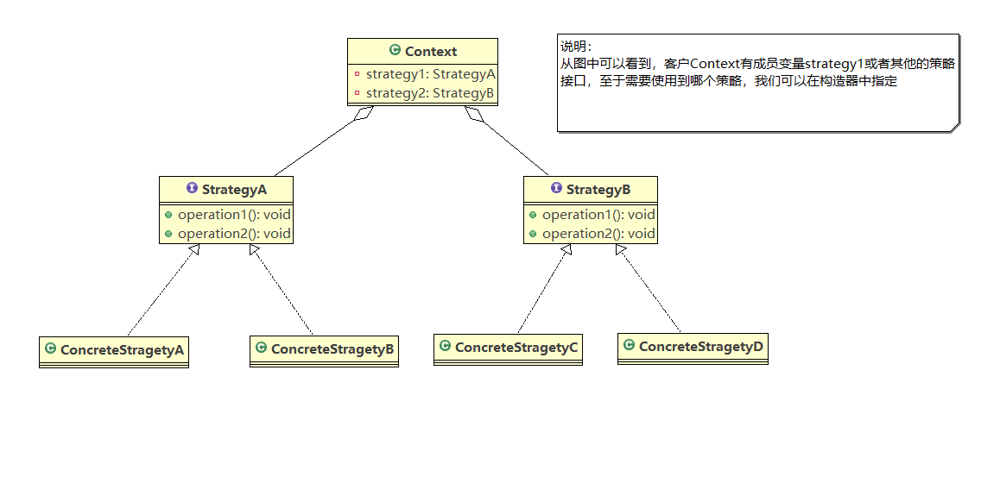

    3. 使用策略模式实现Duck案例
        <1> UML类图如下所示

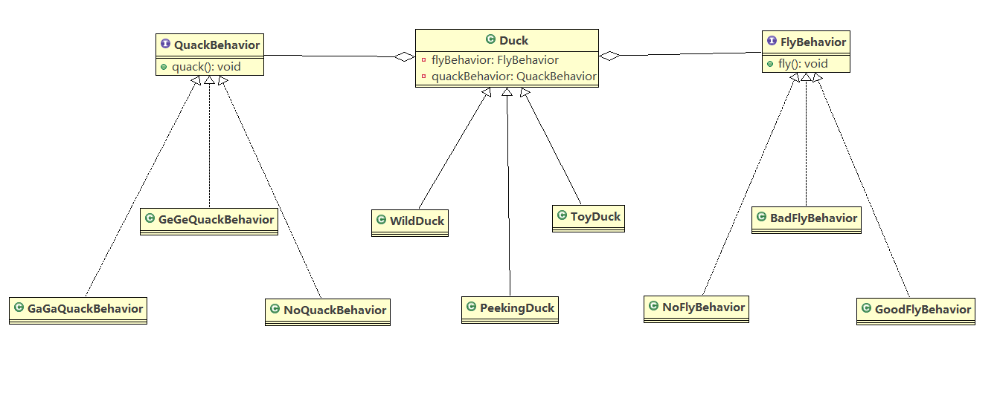
        
        <2> 代码实现参考strategy.improve

    4. 策略模式的源码分析
        <1> Java中的Arrays类中的Comparator就使用了策略模式

        <2> 详细如下所示

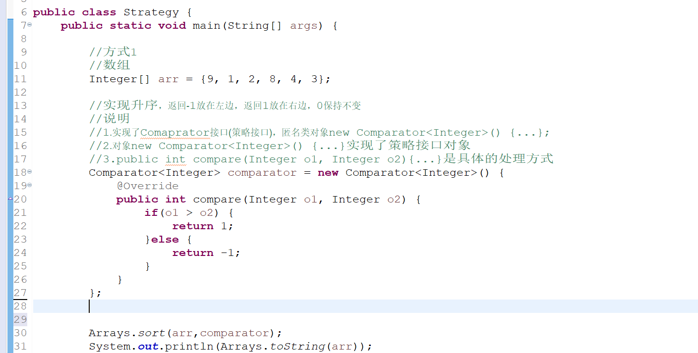

    5. 注意事项
        1) 策略模式的关键是:分析项目中变化部分与不变部分

        2) 策略模式的核心思想是:多用组合/聚合少用继承;用行为类组合，而不是行为的继承。更有弹性

        3) 体现了“对修改关闭，对扩展开放”原则，客户端增加行为不用修改原有代码，只要添加一-种策略(或者行为)即可，避免了
           用多重转移语句(if.else if.else)

        4) 提供了可以替换继承关系的办法: 策略模式将算法封装在独立的Strategy类中使得你可以独立于其Context改变它，使它
           易于切换、易于理解、易于扩展
           
        5) 需要注意的是:每添加一一个策略就要增加一个类，当策略过多是会导致类数目庞大

### 职责链模式
    1. 通过OA系统采购审批需求案例引入职责链模式
        <1> 学校OA系统采购审批项目，需求：
            1) 采购员采购教学器材

            2) 如果金额小于或等于5000，由教学主任审批(0 <= X <= 5000)

            3) 如果金额小于或等于10000，由院长审批(5000 < X <= 10000)

            4) 如果金额小于或等于30000，由副校长审批(10000 < X <= 30000)

            5) 如果金额小于或等于10000，由院长审批(30000 < X)

            6) 请设计程序完成采购审批项目

        <2> 传统解决方案
            1) 直接创建审批类，使用if else来进行分职责处理

        <3> 问题分析
            1) 传统方式是：接收到一个采购请求后，根据采购金额来调用对应的Approver(审批人)来完成审批

            2) 客户端这里会使用到分支判断(比如switch，if else)来对不同的采购请求处理，这样就存在以下几个问题：
                - 如果各个级别的人员审批金额发生变化，在客户端同样也需要变化

                - 客户端必须明确的知道有多少个审批级别和访问

            3) 这样对一个采购请求进行处理和Approver(审批人)就存在强耦合关系，不利于代码的维护和扩展

    2. 职责链模式的基本介绍
        <1> 基本介绍
            1) 职责链模式(Chain of Pattern),又叫责任链模式，为请求穿件了一个接收者对象的链，这种模式对请求的发送者
               和接收者进行解耦

            2) 职责链模式通常每个接收者都包含对另外一个接收者的引用。如果一个对象不能处理该请求，那么它会把相同的请求
               传递给下一个接收者，以此类推

            3) 职责链模式使多个对象都有机会处理请求，从而避免请求的发送者和接收者之间的耦合关系，将对象连成一个条链，
               并且沿着这条链传递该请求，直到有一个对象处理该请求

        <2> UML类图如下 

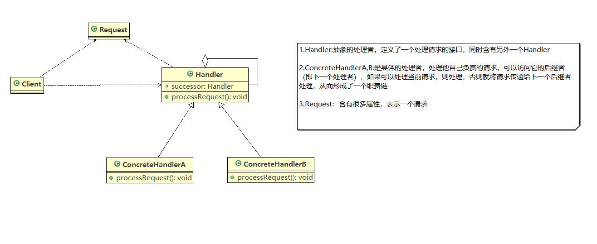 

    3. 使用职责链模式实现采购案例
        <1> UML类图如下所示
    
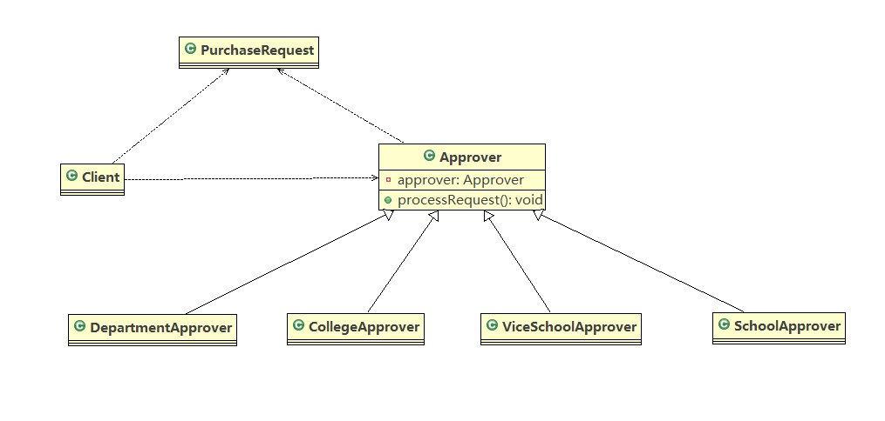 

        <2> 代码实现参考chainofresponsibility

    4. 职责链模式源码分析
        <1> 在SpringMVC-HandlerExcutionChain中就使用到了职责链模式

        <2> SpringMVC请求流程图如下所示

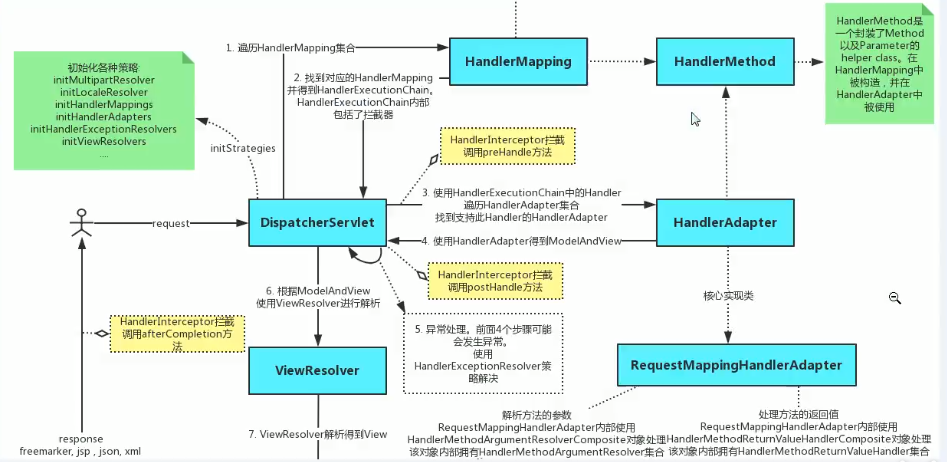 

        <3> 说明
            1) springmvc请求流程图中，执行了拦截器相关方法 intercepter.preHandler方法等等

            2) 在处理SpringMVC请求时，使用到了职责链模式和适配器模式

            3) HandlerExcutionChain主要负责的是请求拦截器的执行和请求处理，但它本身不是处理请求，只是将请求分配给链
               上注册处理器执行，这是职责链实现方式，减少职责链本上与处理逻辑之间的耦合，规范了处理流程

            4) HandlerExcutionChain维护了HandlerIntercepter的集合，可以向其中注册相应的拦截器

    5. 职责链模式的注意事项
        1) 将请求和处理分开，实现解耦，提高系统的灵活性
        
        2) 简化了对象，使对象不需要知道链的结构
        
        3) 性能会受到影响，特别是在链比较长的时候，因此需控制链中最大节点数量，一般通过在Handler中设置一个最大节点
           数量，在setNext()方法中判断是否已经超过阈值，超过则不允许该链建立，避免出现超长链无意识地破坏系统性能

        4) 调试不方便。采用了类似递归的方式，调试时逻辑可能比较复杂
       
        5) 最佳应用场景:有多个对象可以处理同-一个请求时，比如:多级请求、请假/加薪等审批流程、Java Web中Tomcat对
                       Encoding的处理、拦截器

